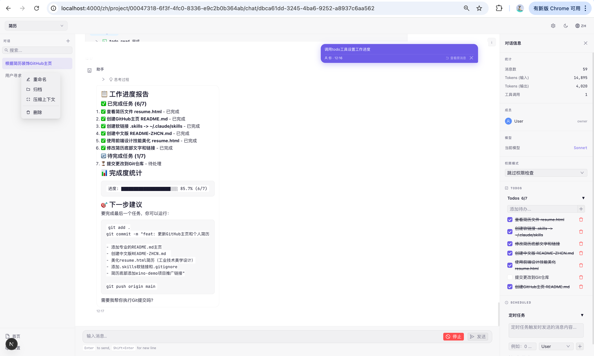
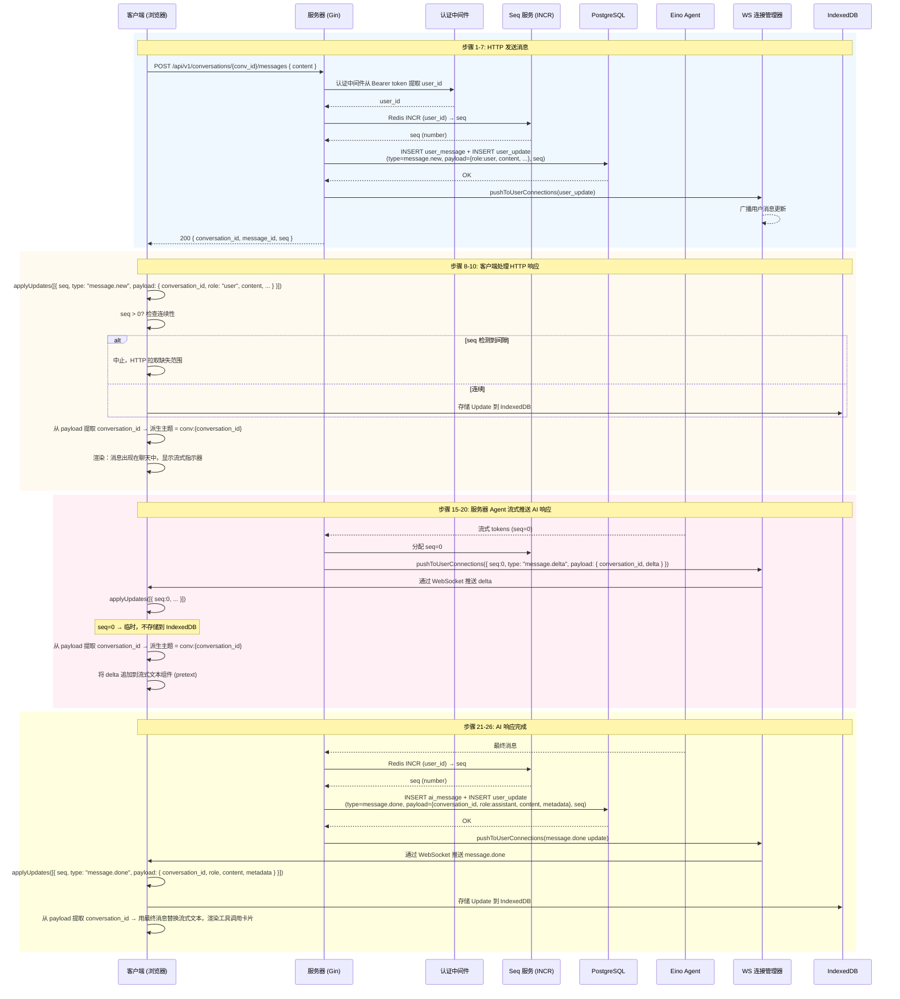
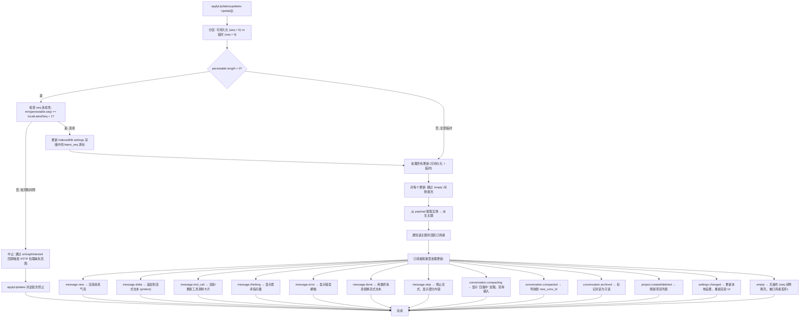
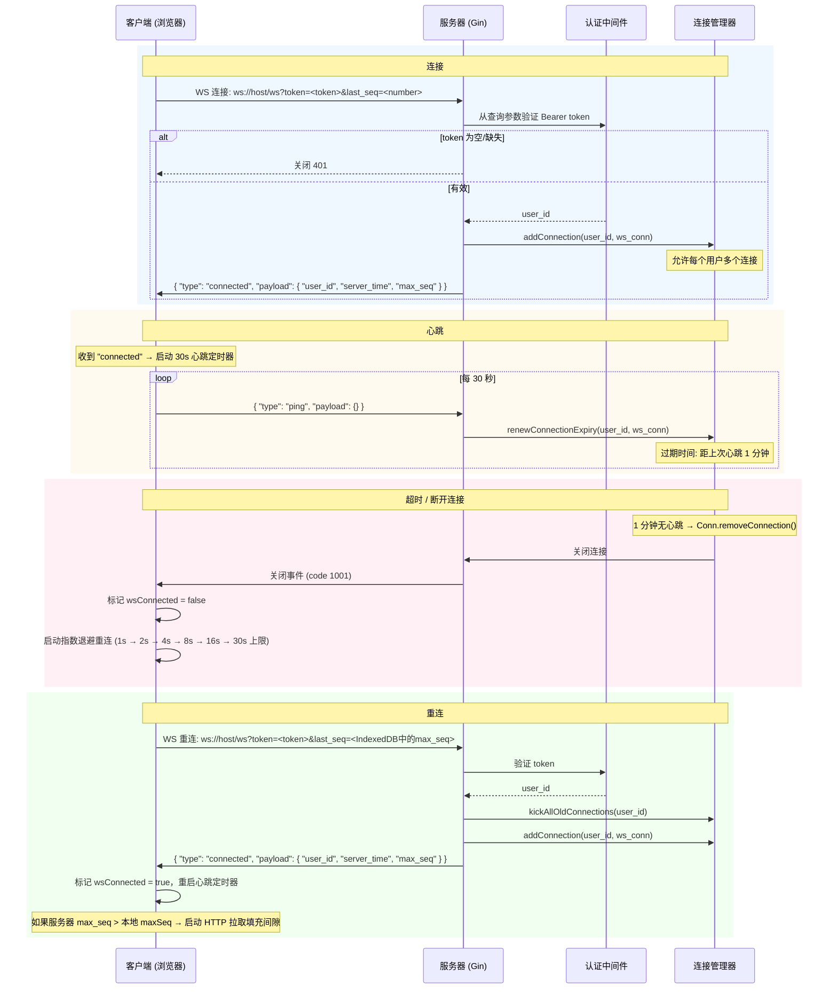

# Eino Demo

> 一个用于学习 [CloudWeGo Eino](https://github.com/cloudwego/eino) 框架的交互式教育平台 —— 从基础的 Agent 集成到高级的多智能体编排模式。

<p align="center">
  
  
  
  
  
  
</p>

<p align="center">
  
</p>

---

## 目录

- [项目概述](#项目概述)
- [架构设计](#架构设计)
- [技术栈](#技术栈)
- [功能列表](#功能列表)
  - [已实现](#-已实现)
  - [开发中](#-开发中)
  - [路线图](#-路线图)
- [项目结构](#项目结构)
- [快速开始](#快速开始)
- [实时通信机制](#实时通信机制)
- [API 与类型安全](#api-与类型安全)
- [设计原则](#设计原则)
- [贡献](#贡献)
- [许可证](#许可证)

---

## 项目概述

Eino Demo 是一个**全栈 AI 应用平台**，展示了使用 [CloudWeGo Eino](https://github.com/cloudwego/eino) 构建 LLM 驱动应用的生产级模式。

用户浏览预置的项目模板，创建与 AI Agent 的交互式对话，通过实际操作学习智能体编排模式——所有这些都在一个精美的 Web 界面中完成。

### 核心设计决策

| 决策 | 理由 |
|------|------|
| **Service-first 架构** | `internal/service/` 是唯一真实来源；HTTP 处理器和 Eino Tool 都委托给相同的服务方法 |
| **统一更新管道** | WebSocket 推送和 HTTP 响应共享相同的 `Update` 事件格式，基于 `seq` 排序 |
| **InferTool 自动生成 schema** | 类型化的 Go 结构体自动生成 LLM 工具选择的 JSON schema——无需手写 |
| **OpenAPI 类型生成** | 一个 `spec.yaml` 同时生成 Go 和 TypeScript 类型，保证字段名一致 |
| **IndexedDB 持久化** | 前端缓存实体用于离线恢复；`latest_seq` 跟踪全局同步游标 |

---

## 架构设计

```
┌─────────────────────────────────────────────────────────────────┐
│                     前端 (Next.js)                               │
│  ┌──────────┐  ┌──────────────┐  ┌─────────────┐  ┌────────── │
│  │  页面     │  │  组件          │  │  Providers   │  │  Hooks   │ │
│  │ App Router│  │  Ant Design   │  │  Context API │  │  WS/DB   │ │
│  └─────────┘  └──────┬───────┘  └──────┬───────┘  └────┬─────┘ │
│        └──────────────┴─────────────────┴────────────────┘       │
│                           │                                      │
│              ┌────────────▼────────────┐                         │
│              │   applyUpdates()        │                         │
│              │   UpdateDispatcher      │                         │
│              │   主题路由 + seq 连续性  │                         │
│              └────────┬───────────────┘                         │
│                       │                                          │
│         ┌─────────────┼──────────────┐                          │
│         ▼             ▼              ▼                          │
│    WebSocket     HTTP API       IndexedDB                        │
│    实时推送       RESTful       持久化                           │
└─────────────────────────────────────────────────────────────────┘
                              │
                              ▼
┌─────────────────────────────────────────────────────────────────┐
│                     后端 (Go + Gin)                              │
│  ┌──────────┐  ┌──────────────┐  ┌─────────────┐  ┌────────── │
│  │ Handlers  │  │   Services   │  │   Eino       │  │  Models  │ │
│  │ (薄层)    │  │  (业务逻辑)   │  │  (Agents)    │  │  (GORM)  │ │
│  └─────────┘  └──────┬───────┘  └──────┬───────┘  └────┬─────┘ │
│        └──────────────┴─────────────────┴────────────────┘       │
│                           │                                      │
│              ┌────────────▼────────────┐                         │
│              │   RootRunner            │                         │
│              │   DeepAgent 构建器       │                         │
│              │   中间件链               │                         │
│              │   流式回调               │                         │
│              └────────┬───────────────┘                         │
│                       │                                          │
│         ┌─────────────┼──────────────┐                          │
│         ▼             ▼              ▼                          │
│    PostgreSQL      Redis        WebSocket                        │
│    AutoMigrate     seq 队列      共享端口                         │
└─────────────────────────────────────────────────────────────────┘
```

### Agent 执行流水线

```
用户消息
    │
    ▼
┌─────────────────────────────────────────────┐
│  RootRunner (DeepAgent 构建器)               │
│  ┌───────────────────────────────────────┐   │
│  │ 1. 上下文注入 (对话元数据)              │   │
│  │ 2. 技能加载 (SKILL.md 文件)            │   │
│  │ 3. ChatModelAgent + Tools (ReAct)      │   │
│  │ 4. 权限中间件                           │   │
│  │ 5. 摘要中间件                           │   │
│  │ 6. 上下文缩减                           │   │
│  └───────────────────────────────────────┘   │
│                                              │
│  流式回调 ──→ WebSocket 推送                 │
│  - OnOutputting  → message.delta             │
│  - OnThinking    → message.thinking          │
│  - OnToolCall    → tool_call + result        │
│  - OnInterrupted → hitl prompt               │
│  - OnCompleted   → message.done              │
│  - OnError       → message.error             │
└─────────────────────────────────────────────┘
```

---

## 技术栈

### 后端

| 组件 | 技术 |
|------|------|
| 语言 | Go 1.26+ |
| Web 框架 | Gin + `github.com/coder/websocket` (共享端口) |
| 依赖注入 | `go.uber.org/fx` |
| ORM | GORM + PostgreSQL (AutoMigrate) |
| 缓存 | Redis (每用户 `seq` 通过 `INCR`，连接状态，心跳) |
| AI 框架 | CloudWeGo Eino + eino-ext |
| 日志 | `go.uber.org/zap` (结构化) |
| 模板 | `embed.FS` + `text/template` |
| 调度 | `robfig/cron` |
| Shell 解析 | `mvdan/sh` (基于 AST 的安全分析) |

### 前端

| 组件 | 技术 |
|------|------|
| 框架 | Next.js (App Router) + React + TypeScript |
| UI 库 | Ant Design |
| 国际化 | `next-intl` (中文 / 英文) |
| 状态管理 | React Context + `useReducer` |
| 流式文本 | `@chenglou/pretext` |
| Markdown | `react-markdown` + `remark-gfm` + `rehype-highlight` |
| 持久化 | IndexedDB (消息、对话、设置) |
| 类型生成 | `openapi-typescript` 从共享 `spec.yaml` 生成 |

### 基础设施

| 组件 | 用途 |
|------|------|
| PostgreSQL 15+ | 主数据存储，支持 JSONB 字段 |
| Redis 7+ | 连接状态、`seq` 分配、心跳 |
| Docker Compose | 本地开发环境 (PostgreSQL + Redis + Grafana + Prometheus) |

---

## 功能列表

### 已实现

#### 核心平台

- **项目模板系统** — 浏览并实例化预构建的项目蓝图；每个模板定义 Agent 配置、工具和初始提示词
- **项目管理** — 完整的 CRUD 操作，通过 WebSocket 推送实现实时同步
- **对话管理** — 在项目内创建、列表、删除和分支对话
- **对话模式切换** — 每个对话可在 `ask_before_edits`、`edit_automatically`、`bypass_permissions`、`plan_mode` 之间切换
- **演示认证** — 基于 token 的无状态认证，使用 `FirstOrCreate` 解析用户

#### AI Agent 系统

- **DeepAgent 执行引擎** — 完整的 ReAct 循环，通过 Eino 的 `adk.NewChatModelAgent` + `adk.NewRunner` 构建
- **流式响应** — 通过 WebSocket 实现逐 token 实时推送，带光标动画
- **模型档位选择** — 三档：`haiku` (轻量)、`sonnet` (通用)、`opus` (复杂推理)
- **工具调用展示** — 可折叠卡片，显示工具名称、输入参数、结果、状态和耗时
- **中断与停止** — 主动流式中断，优雅取消
- **上下文压缩** — 当 token 数量超过阈值时，基于 LLM 的历史摘要
- **子 Agent 生成** — 生成子对话，异步执行 Agent 并将结果回写到父对话；JSONL 结构化日志用于子 Agent 追踪

#### 权限与安全

- **权限网关** — 拦截工具调用，展示审批 UI，等待用户决策后执行
- **LLM 安全评估器** — 对文件系统和 HTTP 工具操作进行风险评估 (1-4 级)
- **基于 AST 的 Shell 分析** — 使用 `mvdan/sh` 解析器在执行前进行命令安全评估
- **工作区边界检查** — 文件系统工具强制执行目录限制
- **权限决策** — `approve`、`approve_exact`、`approve_wildcard`、`deny`，带持久化

#### 交互式工具

- **HITL (人机协同)** — `ask_user_question` 工具支持单选、多选和自由文本答案类型；模态 UI 支持子对话中断冒泡
- **Todo 管理** — 通过工具调用创建、更新和删除对话范围的 Todo；实时面板同步
- **Cron 调度** — 使用 cron 表达式或 `once:N` 持续时间调度任务；执行跟踪和结果记录
- **天气工具** — 模拟天气 API，用于工具演示
- **网络搜索** — Tavily API 集成 (条件性，需要 API Key)
- **文件系统工具** — `read_file`、`write_file`、`edit_file`、`glob`、`grep`，带安全网关
- **HTTP 工具** — `GET`、`POST`、`PUT`、`DELETE`，包装在权限网关中
- **Shell 执行** — 带 AST 安全分析的命令执行

#### 前端体验

- **完整聊天界面** — 消息列表带粘性最后用户消息栏，Markdown 渲染，语法高亮代码块
- **流式动画** — 通过 `@chenglou/pretext` 实现实时 token 渲染和光标动画
- **HITL 模态框** — 交互式问题提示，支持多种选择类型 (单选/多选/文本)
- **权限请求卡片** — 工具调用决策的可视化审批 UI
- **子对话中断聚合** — 将子 Agent 的中断冒泡到父对话 UI
- **IndexedDB 持久化** — 离线消息缓存和恢复
- **主题支持** — 通过 Ant Design `ConfigProvider` 实现亮/暗模式，localStorage 持久化
- **设置页面** — 模型档位、语言、主题配置

#### 开发者体验

- **OpenAPI 类型生成** — 一个 `spec.yaml` 生成 Go 和 TypeScript 类型，始终同步
- **InferTool 自动 schema** — 类型化 Go 结构体自动生成 JSON schema 供 LLM 工具选择
- **Service-first 架构** — 一个实现，两个消费者 (HTTP + Eino Tool)
- **结构化日志** — JSONL 日志用于子 Agent 追踪和调试
- **技能系统** — 基于文件系统的 `SKILL.md` 加载，扩展 Agent 能力

### 开发中

- **模板库扩展** — 11 个额外模板，覆盖 Chain、Graph、Workflow、RAG、Deep Agent、Plan & Execute、Supervisor、Full App 等模式
- **国际化完善** — 所有 UI 文本的中英文翻译补全
- **对话归档 UI** — 压缩后对话的只读视图，带加载状态
- **回调可视化面板** — 实时面板展示 Agent 执行流程、工具调用链和耗时
- **HTTP 轮询降级** — WebSocket 不可用时的指数退避轮询

### 路线图

#### Phase 2 — 多 Agent 与高级模式

| 功能 | 描述 |
|------|------|
| **Chain 工作流模板** | Prompt → Model → Parse 组合，带字段映射 |
| **Graph 分支模板** | 条件路由、并行节点执行、动态路径 |
| **Workflow 组合模板** | 声明式依赖、复杂字段映射 |
| **Deep Agent 模板** | 子 Agent 委托，任务传递和结果聚合 |
| **Plan & Execute 模板** | 两阶段 Agent：先生成计划，再执行 |
| **Supervisor 模板** | 多 Agent 监督，带委托和质量控制 |
| **Interrupt & Resume 模板** | 完整的 HITL 工作流，带检查点保存/恢复 |
| **Callbacks & Tracing 模板** | Langfuse / LangSmith 集成，实现可观测性 |

#### Phase 3 — RAG 与生产就绪

| 功能 | 描述 |
|------|------|
| **RAG Pipeline 模板** | 文档加载 → Embedding → 向量索引 → 检索 → QA 链 |
| **向量数据库集成** | pgvector 扩展设置和文档块存储 |
| **Tool Workshop 模板** | MCP 服务器集成、自定义 InferTool 构建、HTTP 工具模式 |
| **Full App 集成模板** | 所有 Eino 功能集成到单个可运行项目中 |
| **多 Provider 支持** | 通过 `llm_providers` 表动态切换 LLM 提供商 |
| **回调可视化** | 交互式面板展示执行图、延迟和 token 消耗 |
| **全面测试套件** | 实时端点测试、集成测试 (真实 PostgreSQL + LLM) |
| **可观测性仪表盘** | Grafana 仪表盘展示 Agent 延迟、token 消耗、错误率 |

#### 未来探索

| 功能 | 描述 |
|------|------|
| **Agent 记忆系统** | 基于向量检索的长期记忆，跨对话上下文 |
| **多用户协作** | 实时协作对话，基于角色的权限控制 |
| **插件市场** | 社区贡献的工具和模板 |
| **Prompt 版本控制** | 类似 Git 的 Prompt 差异比较和回滚 |
| **Agent 基准测试** | 自动化评估套件，跨模板比较模型档位 |
| **移动端响应式 UI** | 完整的平板和移动端支持，自适应布局 |
| **语音输入/输出** | 语音转文字输入和文字转语音回复播放 |
| **自定义 Agent 构建器** | 浏览器中的无代码可视化 Agent 编排 |

---

## 实时通信机制

整个通信架构采用 **类似 Telegram 的 Update 机制**——与 Telegram Bot API、Telegram Web 和 Telegram MTProto 相同的设计模式。这证明了对高吞吐量消息系统的实战经验。

**核心思想来自 Telegram**：不通过 WebSocket 发送完整实体，而是推送增量的 `Update` 事件。每个 `Update` 携带单调递增的 `seq` 序号、`type` 类型区分器和 `payload` 数据。客户端通过单一的 `applyUpdates()` 入口点处理更新——无论它来自 WebSocket 推送还是 HTTP 轮询。

### Update 信封

```json
{
  "seq": 0,
  "type": "message.delta",
  "payload": { "conversation_id": "...", "delta": "token text" }
}
```

- `seq > 0` → 持久化 (存储在 DB 中，重连时可重放，存入 IndexedDB)
- `seq = 0` → 临时 (流式 token、思考片段——不持久化)

### Seq 分配与间隙填充

服务器通过 Redis `INCR("seq:{user_id}")` 分配 `seq`。由于 `INCR` 在 DB 写入**之前**执行，失败的 DB 写入会在序列中留下间隙。服务器用 `empty` 更新填充每个间隙，确保前端的 seq 连续性检查始终通过——这正是 Telegram 更新交付中使用的技术。

### 双路径交付

| 路径 | 触发条件 | 载荷 |
|------|----------|------|
| **HTTP 响应** | 客户端发起的操作 (发送消息、创建对话) | 返回用户自己消息的 `seq` + `conversation_id` |
| **WebSocket 推送** | 服务器发起的事件 (AI 流式、工具调用、通知) | 批量 `[]Update` 数组推送给所有用户连接 |
| **HTTP 轮询降级** | WS 断开连接时——指数退避 (1s → 2s → 4s → 30s 上限) | 与 WebSocket 相同的 `Update` 格式，带 seq 间隙填充 |

所有三条路径都输入到**同一个** `applyUpdates()` 管道中。一套代码，零重复。

### 通信流程：发送消息



### applyUpdates() 流程



### 完整 Update 类型表

| `type` | `seq` | 触发条件 | 发送方式 |
| --- | --- | --- | --- |
| `message.new` | `> 0` | 消息持久化 (用户或 AI) | WS + HTTP 响应 |
| `message.delta` | `0` | Agent 流式 token | 仅 WS |
| `message.done` | `> 0` | Agent 响应完成 | WS |
| `message.tool_call` | `> 0` | 工具执行结果 | WS |
| `message.thinking` | `0` | 模型推理 token | 仅 WS |
| `message.error` | `> 0` | Agent 或系统错误 | WS |
| `message.stop` | `> 0` | 用户中断流式 | WS |
| `conversation.created` | `> 0` | 新对话创建 | WS + HTTP 响应 |
| `conversation.deleted` | `> 0` | 对话删除 | WS |
| `conversation.compacting` | `> 0` | 上下文压缩开始 | WS |
| `conversation.compacted` | `> 0` | 压缩完成 | WS |
| `conversation.archived` | `> 0` | 对话归档 | WS |
| `project.created` | `> 0` | 从模板创建项目 | WS + HTTP 响应 |
| `project.deleted` | `> 0` | 项目删除 | WS |
| `settings.changed` | `> 0` | 设置更新 | WS |
| `empty` | `> 0` | Seq 间隙填充 (INCR 不回滚) | WS + HTTP 响应 |
| `connected` | -- | WS 连接建立 | 仅 WS |

### WebSocket 连接生命周期



### 为什么选择 Telegram 的模式？

Telegram 的 Update 机制已在 **8 亿+ 用户**、**每天数十亿消息**的规模上经过实战验证。它为本项目带来的核心优势：

1. **零消息丢失** — 基于 seq 的排序，间隙检测和 HTTP 拉取恢复，确保每个事件精确交付一次
2. **离线弹性** — 重连时通过 `last_seq` 重放所有错过的更新；IndexedDB 缓存全局游标
3. **单一管道** — `applyUpdates()` 以相同方式处理所有来源 (WS 推送、HTTP 响应、HTTP 轮询)
4. **临时 vs 持久** — `seq=0` 用于流式 token (无需 DB 写入)，`seq>0` 用于持久化事件 (可重放)
5. **基于主题的路由** — 前端从路由上下文派生主题，组件只为相关更新重新渲染
6. **间隙填充** — 服务器为缺失的 seq 号插入 `empty` 更新，确保连续性检查永不失败

---

## 项目结构

```
.
├── server/                          # Go 后端
│   ├── cmd/server/main.go           # 入口: flags + Fx + Run
│   └── internal/
│       ├── config/                  # 最小配置: flag + env
│       ├── db/                      # GORM 初始化 + AutoMigrate + pgvector
│       ├── di/                      # Fx 模块绑定
│       ├── handler/                 # HTTP 处理器 (薄层, 委托给 service)
│       ├── model/                   # GORM 模型 (17 张表)
│       ├── service/                 # 业务逻辑 (唯一真实来源)
│       ├── ws/                      # WebSocket: 管理器、协议、队列
│       ├── eino/
│       │   ├── runner/              # RootRunner: Agent 构建器 + 中间件
│       │   ├── tools/               # Eino Tools (InferTool 注册)
│       │   ├── skills/              # 技能系统 (SKILL.md 加载)
│       │   └── permission/          # 权限网关 + LLM 评估器
│       └── templates/               # 模板注册 + 定义
│
├── web/                             # Next.js 前端
│   └── src/
│       ├── app/[locale]/            # App Router + 国际化
│       │   ├── page.tsx             # 首页: ProjectList + TemplateList
│       │   ├── settings/page.tsx    # 设置: 模型/语言/主题
│       │   └── project/[id]/chat/[convId]/  # 完整聊天界面
│       ├── components/chat/         # MessageList, Bubble, Input, 工具卡片
│       ├── lib/
│       │   ├── api.ts               # 类型化 HTTP 客户端
│       │   └── updateDispatcher.ts  # applyUpdates() 单例
│       ├── providers/               # React Context (Update, WS, Theme)
│       ├── store/                   # IndexedDB 辅助 + 主题路由
│       └── hooks/                   # useTheme, useWebSocket, useStream
│
├── openapi/
│   └── spec.yaml                    # API 类型的唯一真实来源
│
├── docs/                            # 文档
│   ├── API.md                       # API 规范
│   └── DATABASE_POSTGRESQL.md       # 数据库 schema + ER 图
│
└── deploy/dependencies/dev/         # Docker Compose: PostgreSQL + Redis + Grafana
```

---

## 快速开始

### 前置条件

- Go 1.26+
- Node.js 20+
- Docker & Docker Compose
- PostgreSQL 15+
- Redis 7+

### 1. 启动依赖

```bash
docker compose -f deploy/dependencies/dev/docker-compose.yaml up -d
```

### 2. 配置环境变量

```bash
cp server/.env.example server/.env
# 编辑 server/.env，填入 LLM API Key 和数据库凭据
```

### 3. 启动后端

```bash
cd server
go run ./cmd/server/main.go
```

### 4. 启动前端

```bash
cd web
npm install
npm run dev
```

### 5. 在浏览器中打开

访问 `http://localhost:3000` 开始聊天！

---

## API 与类型安全

本项目通过单一真实来源在整个技术栈中强制执行**类型一致性**：

```
openapi/spec.yaml
       │
       ├──(generate.sh)──→ server/internal/types/types.go (Go)
       │
       └──(generate.sh)──→ web/src/types/api.d.ts (TypeScript)
```

- **一个规范，两个代码库** — 运行 `openapi/generate.sh` 同时重新生成 Go 和 TypeScript 类型
- **绝不手写** spec 中已存在的请求/响应类型
- **InferTool** 从类型化 Go 结构体自动生成 JSON schema 供 LLM 工具选择

### API 约定

- 所有错误使用统一格式: `{ "error": { "code": "ERROR_CODE", "message": "..." } }`
- 标准 HTTP 状态码: 400, 401, 404, 500
- 错误响应中绝不泄露堆栈跟踪或内部细节

---

## 设计原则

| 原则 | 实现 |
|------|------|
| **Service-first** | `internal/service/` 是唯一真实来源；HTTP 处理器和 Eino Tool 都委托给它 |
| **薄层处理器** | 解码 → 调用服务 → 编码。处理器层零业务逻辑 |
| **一个实现，两个消费者** | 同一个服务方法同时服务 REST API 和 LLM Tool 调用 |
| **结构化日志** | 全部通过 `zap` 日志；不使用 `fmt.Println` |
| **显式错误处理** | 不使用裸返回，不忽略错误 |
| **表格驱动测试** | 所有逻辑覆盖表格驱动测试 |
| **约定式提交** | 所有提交遵循 Conventional Commits 格式 |

---

## 贡献

欢迎提交 Issue 和 Pull Request！

1. Fork 本项目
2. 创建功能分支 (`git checkout -b feature/AmazingFeature`)
3. 提交更改 (`git commit -m 'Add some AmazingFeature'`)
4. 推送到分支 (`git push origin feature/AmazingFeature`)
5. 创建 Pull Request

---

## 许可证

MIT

---

<div align="center">

**使用** Go、Next.js、CloudWeGo Eino、PostgreSQL、Redis 和 Ant Design 构建

[需求文档](REQUIREMENTS.md) · [API 文档](docs/API.md) · [数据库 Schema](docs/DATABASE_POSTGRESQL.md)

</div>
