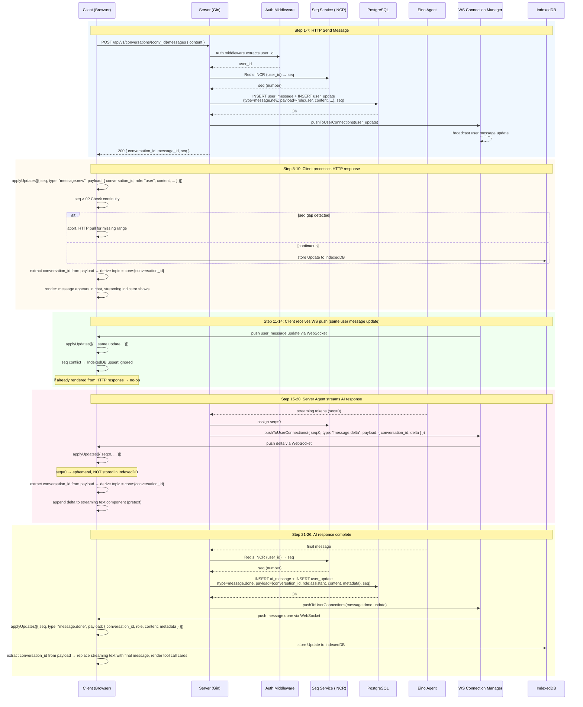
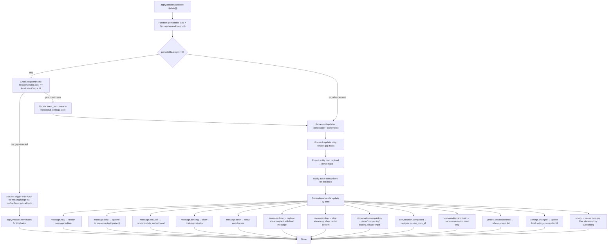
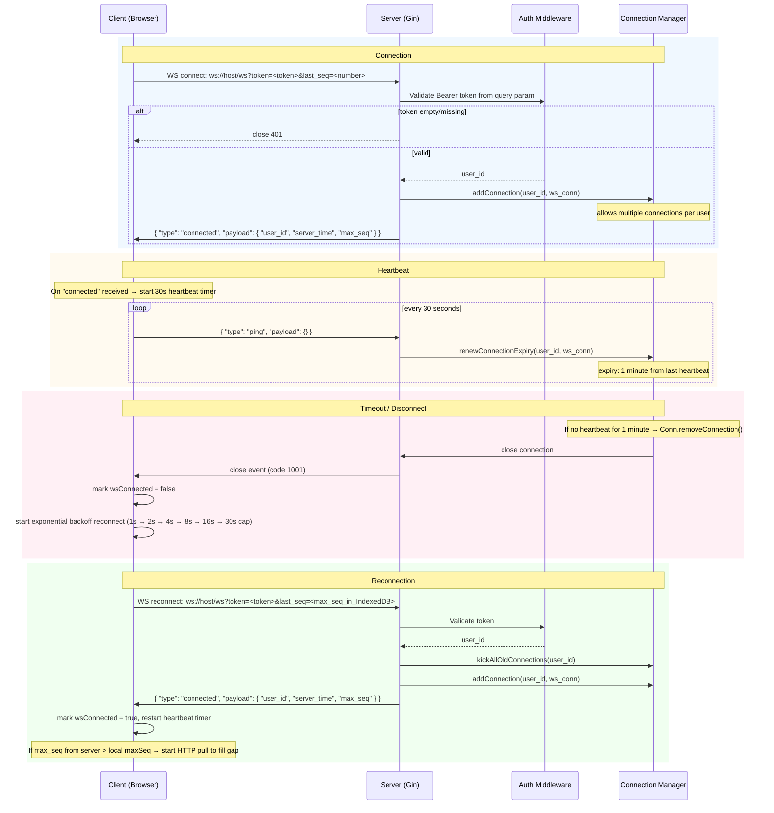

# Eino Demo

> An interactive educational platform for learning the [CloudWeGo Eino](https://github.com/cloudwego/eino) framework — from basic agent integration to advanced multi-agent orchestration patterns.

<p align="center">
  
  
  
  
  
  
</p>

<p align="center">
  
</p>

---

## Table of Contents

- [Overview](#overview)
- [Architecture](#architecture)
- [Tech Stack](#tech-stack)
- [Features](#features)
  - [Implemented](#-implemented)
  - [In Development](#-in-development)
  - [Roadmap](#-roadmap)
- [Project Structure](#project-structure)
- [Quick Start](#quick-start)
- [API & Type Safety](#api--type-safety)
- [Design Principles](#design-principles)
- [Contributing](#contributing)
- [License](#license)

---

## Overview

Eino Demo is a **full-stack AI application platform** that demonstrates production-grade patterns for building LLM-powered applications with [CloudWeGo Eino](https://github.com/cloudwego/eino).

Users browse pre-built project templates, create interactive conversations with AI agents, and learn agent orchestration patterns through hands-on experience — all within a polished web interface.

### Key Design Decisions

| Decision | Rationale |
|----------|-----------|
| **Service-first architecture** | `internal/service/` is the single source of truth; both HTTP handlers and Eino Tools delegate to the same service methods |
| **Unified update pipeline** | WebSocket push and HTTP responses share the same `Update` event format with `seq`-based ordering |
| **InferTool schema generation** | Typed Go structs auto-generate JSON schemas for LLM tool selection — no manual schema writing |
| **OpenAPI type generation** | One `spec.yaml` generates both Go and TypeScript types, guaranteeing field-name consistency |
| **IndexedDB persistence** | Frontend caches entities for offline recovery; `latest_seq` tracks the global sync cursor |

---

## Architecture

```
┌─────────────────────────────────────────────────────────────────┐
│                        Frontend (Next.js)                       │
│  ┌──────────┐  ┌──────────────┐  ┌─────────────┐  ┌──────────┐ │
│  │  Pages    │  │  Components   │  │  Providers   │  │  Hooks   │ │
│  │ App Router│  │  Ant Design   │  │  Context API │  │  WS/DB   │ │
│  └─────┬────┘  └──────┬───────┘  └──────┬───────┘  └────┬─────┘ │
│        └──────────────┴─────────────────┴────────────────┘       │
│                           │                                      │
│              ┌────────────▼────────────┐                         │
│              │   applyUpdates()        │                         │
│              │   UpdateDispatcher      │                         │
│              │   topic routing + seq   │                         │
│              └────────┬───────────────┘                         │
│                       │                                          │
│         ┌─────────────┼──────────────┐                          │
│         ▼             ▼              ▼                          │
│    WebSocket     HTTP API       IndexedDB                        │
│    real-time     RESTful       persistence                       │
└─────────────────────────────────────────────────────────────────┘
                              │
                              ▼
┌─────────────────────────────────────────────────────────────────┐
│                     Backend (Go + Gin)                          │
│  ┌──────────┐  ┌──────────────┐  ┌─────────────┐  ┌──────────┐ │
│  │ Handlers  │  │   Services   │  │   Eino       │  │  Models  │ │
│  │ (thin)    │  │  (business)  │  │  (agents)    │  │  (GORM)  │ │
│  └─────┬────┘  └──────┬───────┘  └──────┬───────┘  └────┬─────┘ │
│        └──────────────┴─────────────────┴────────────────┘       │
│                           │                                      │
│              ┌────────────▼────────────┐                         │
│              │   RootRunner            │                         │
│              │   DeepAgent builder     │                         │
│              │   middleware chain      │                         │
│              │   streaming callbacks   │                         │
│              └────────┬───────────────┘                         │
│                       │                                          │
│         ┌─────────────┼──────────────┐                          │
│         ▼             ▼              ▼                          │
│    PostgreSQL      Redis        WebSocket                        │
│    AutoMigrate     seq queue    shared port                      │
└─────────────────────────────────────────────────────────────────┘
```

### Agent Execution Pipeline

```
User Message
    │
    ▼
┌─────────────────────────────────────────────┐
│  RootRunner (DeepAgent Builder)              │
│  ┌───────────────────────────────────────┐   │
│  │ 1. Context Injection (conv metadata)   │   │
│  │ 2. Skill Loading (SKILL.md files)      │   │
│  │ 3. ChatModelAgent + Tools (ReAct)      │   │
│  │ 4. Permission Middleware               │   │
│  │ 5. Summarization Middleware            │   │
│  │ 6. Context Reduction                   │   │
│  └───────────────────────────────────────┘   │
│                                              │
│  Streaming Callbacks ──→ WebSocket Push      │
│  - OnOutputting  → message.delta             │
│  - OnThinking    → message.thinking          │
│  - OnToolCall    → tool_call + result        │
│  - OnInterrupted → hitl prompt               │
│  - OnCompleted   → message.done              │
│  - OnError       → message.error             │
└─────────────────────────────────────────────┘
```

---

## Tech Stack

### Backend

| Component | Technology |
|-----------|-----------|
| Language | Go 1.26+ |
| Web Framework | Gin + `github.com/coder/websocket` (shared port) |
| DI Container | `go.uber.org/fx` |
| ORM | GORM + PostgreSQL (AutoMigrate) |
| Cache | Redis (per-user `seq` via `INCR`, connection state, heartbeat) |
| AI Framework | CloudWeGo Eino + eino-ext |
| Logging | `go.uber.org/zap` (structured) |
| Templates | `embed.FS` + `text/template` |
| Scheduling | `robfig/cron` |
| Shell Parsing | `mvdan/sh` (AST-based safety analysis) |

### Frontend

| Component | Technology |
|-----------|-----------|
| Framework | Next.js (App Router) + React + TypeScript |
| UI Library | Ant Design |
| i18n | `next-intl` (en / zh) |
| State | React Context + `useReducer` |
| Streaming Text | `@chenglou/pretext` |
| Markdown | `react-markdown` + `remark-gfm` + `rehype-highlight` |
| Persistence | IndexedDB (messages, conversations, settings) |
| Type Generation | `openapi-typescript` from shared `spec.yaml` |

### Infrastructure

| Component | Purpose |
|-----------|---------|
| PostgreSQL 15+ | Primary data store with JSONB fields |
| Redis 7+ | Connection state, `seq` allocation, heartbeat |
| Docker Compose | Local dev environment (PostgreSQL + Redis + Grafana + Prometheus) |

---

## Features

### Implemented

#### Core Platform

- **Project Template System** — Browse and instantiate pre-built project blueprints; each template defines Agent configs, Tools, and initial prompts
- **Project Management** — Full CRUD with real-time sync via WebSocket push
- **Conversation Management** — Create, list, delete, and branch conversations within projects; supports parent-child conversation hierarchy with tree-structured list responses and cycle detection
- **Conversation Hierarchy Tree** — Parent-child relationships via `parent_conversation_id`; sidebar renders an accordion tree component with auto-expand for selected child conversations
- **Conversation Modes** — Switch between `ask_before_edits`, `edit_automatically`, `bypass_permissions`, and `plan_mode` per conversation
- **Demo Authentication** — Stateless token-based auth with `FirstOrCreate` user resolution

#### AI Agent System

- **DeepAgent Execution** — Full ReAct loop with ChatModelAgent + Tools, built via Eino's `adk.NewChatModelAgent` + `adk.NewRunner`
- **Streaming Responses** — Real-time token-by-token delivery via WebSocket with cursor animation
- **Model Tier Selection** — Three tiers: `haiku` (lightweight), `sonnet` (general), `opus` (complex reasoning)
- **Tool Call Display** — Collapsible cards showing tool name, input args, result, status, and duration
- **Interrupt & Stop** — Active streaming interruption with graceful cancellation
- **Context Compression** — LLM-based history summarization when token count exceeds threshold
- **Sub-Agent Spawning** — Spawn sub-conversations with async agent execution and result writeback to parent conversation; JSONL structured logging for sub-agent tracing; cascading stop for sub-agent sessions; context isolation to prevent callback event bubbling

#### Permission & Safety

- **Permission Gateway** — Intercept tool calls, present approval UI, wait for user decision before execution
- **LLM-Based Safety Evaluator** — Risk assessment (levels 1-4) for filesystem and HTTP tool operations
- **AST-Based Shell Analysis** — `mvdan/sh` parser for command safety evaluation before execution
- **Workspace Bounds Checking** — Filesystem tools enforce directory confinement
- **Permission Decisions** — `approve`, `approve_exact`, `approve_wildcard`, `deny` with persistence

#### Interactive Tools

- **HITL (Human-in-the-Loop)** — `ask_user_question` tool with single-select, multi-select, and free-text answer types; modal UI with interrupt bubbling from sub-conversations; project-level HITL sync for off-conversation update notifications
- **Missed Update Notification** — `MissedUpdateNotification` component displayed when WebSocket pushes events outside the current conversation
- **Todo Management** — Create, update, and delete conversation-scoped todos via tool calls; real-time panel sync
- **Cron Scheduling** — Schedule tasks with cron expressions or `once:N` duration; execution tracking and result logging
- **Weather Tool** — Mock weather API for tool demonstration
- **Web Search** — Tavily API integration (conditional, requires API key)
- **Filesystem Tools** — `read_file`, `write_file`, `edit_file`, `glob`, `grep` with safety gates
- **HTTP Tools** — `GET`, `POST`, `PUT`, `DELETE` wrapped with permission gateway
- **Shell Execution** — Command execution with AST-based safety analysis

### Real-Time Communication (Telegram-Style Update Pipeline)

The entire communication architecture is modeled after **Telegram's Update mechanism** — the same approach used in Telegram Bot API, Telegram Web, and Telegram MTProto. This demonstrates production experience with high-throughput messaging systems.

**Key insight from Telegram**: instead of sending full entities over WebSocket, push incremental `Update` events. Each `Update` carries a monotonic `seq` number, a `type` discriminator, and a `payload`. The client applies updates through a single `applyUpdates()` entry point — regardless of whether they came from WebSocket push or HTTP polling.

#### Update Envelope

```json
{
  "seq": 0,
  "type": "message.delta",
  "payload": { "conversation_id": "...", "delta": "token text" }
}
```

- `seq > 0` → persisted (stored in DB, replayable on reconnect, stored in IndexedDB)
- `seq = 0` → ephemeral (streaming tokens, thinking chunks — NOT persisted)

#### Seq Assignment & Gap Filling

The server assigns `seq` via Redis `INCR("seq:{user_id}")`. Because `INCR` runs **before** the DB write, a failed DB write leaves a gap in the sequence. The server fills every gap with `empty` updates so the frontend's seq continuity check always passes — the same technique used in Telegram's update delivery.

#### Dual-Path Delivery

| Path | When | Payload |
|------|------|---------|
| **HTTP Response** | Client-initiated action (send message, create conversation) | Returns user's own message `seq` + `conversation_id` |
| **WebSocket Push** | Server-initiated events (AI streaming, tool calls, notifications) | Batched `[]Update` arrays pushed to all user connections |
| **HTTP Polling Fallback** | WS disconnected — exponential backoff (1s → 2s → 4s → 30s cap) | Same `Update` format with seq gap filling |

All three paths feed into the **same** `applyUpdates()` pipeline. One code path, zero duplication.

#### Communication Flow: Send Message



#### applyUpdates() Flow



#### Full Update Type Table

| `type` | `seq` | Triggered By | Sent Via |
| --- | --- | --- | --- |
| `message.new` | `> 0` | Message persisted (user or AI) | WS + HTTP response |
| `message.delta` | `0` | Agent streaming token | WS only |
| `message.done` | `> 0` | Agent response complete | WS |
| `message.tool_call` | `> 0` | Tool execution result | WS |
| `message.thinking` | `0` | Model reasoning token | WS only |
| `message.error` | `> 0` | Agent or system error | WS |
| `message.stop` | `> 0` | User interrupted stream | WS |
| `conversation.created` | `> 0` | New conversation started | WS + HTTP response |
| `conversation.deleted` | `> 0` | Conversation deleted | WS |
| `conversation.compacting` | `> 0` | Context compression started | WS |
| `conversation.compacted` | `> 0` | Compression completed | WS |
| `conversation.archived` | `> 0` | Conversation archived | WS |
| `project.created` | `> 0` | Project created from template | WS + HTTP response |
| `project.deleted` | `> 0` | Project deleted | WS |
| `settings.changed` | `> 0` | Settings updated | WS |
| `missed.update` | `> 0` | Off-conversation event notification | WS |
| `empty` | `> 0` | Seq gap filler (INCR non-rollback) | WS + HTTP response |
| `connected` | -- | WS connection established | WS only |

#### WebSocket Connection Lifecycle



#### Why Telegram's Pattern?

Telegram's Update mechanism is battle-tested at **800M+ users** handling **billions of messages per day**. The key advantages it brings to this project:

1. **Zero message loss** — Seq-based ordering with gap detection and HTTP pull recovery guarantees every event is delivered exactly once
2. **Offline resilience** — `last_seq` on reconnect replays all missed updates; IndexedDB caches the global cursor
3. **Single pipeline** — `applyUpdates()` handles all sources (WS push, HTTP response, HTTP polling) identically
4. **Ephemeral vs persistent** — `seq=0` for streaming tokens (no DB write needed), `seq>0` for persisted events (replayable)
5. **Topic-based routing** — Frontend derives topics from route context so components only re-render for relevant updates
6. **Gap filling** — Server inserts `empty` updates for missing seq numbers so continuity checks never fail

#### Frontend Experience

- **Full Chat Interface** — Message list with sticky last-user-message bar, Markdown rendering, syntax-highlighted code blocks
- **Streaming Animation** — Real-time token rendering with cursor animation via `@chenglou/pretext`
- **HITL Modal** — Interactive question prompts with choice types (single/multi/text)
- **Permission Request Cards** — Visual approval UI for tool call decisions
- **Sub-Conversation Interrupt Aggregation** — Bubble sub-agent interrupts to parent conversation UI
- **Missed Update Notification** — Banner alert for off-conversation events with quick navigation
- **IndexedDB Persistence** — Offline message caching and recovery
- **Theme Support** — Light/dark mode via Ant Design `ConfigProvider` with localStorage persistence
- **Settings Page** — Model tier, locale, and theme configuration

#### Developer Experience

- **OpenAPI Type Generation** — Single `spec.yaml` generates Go and TypeScript types; always in sync
- **InferTool Auto-Schema** — Typed Go structs auto-generate JSON schemas for LLM tool selection
- **Service-First Architecture** — One implementation, two consumers (HTTP + Eino Tool)
- **Structured Logging** — JSONL logs for sub-agent tracing and debugging
- **Tool Registry Refactor** — Per-request `ToolBuildContext` replaces `SetXXX` pattern for better request isolation
- **Skill System** — Filesystem-backed `SKILL.md` loading for agent capability extension

### In Development

- **Template Library Expansion** — 11 additional templates covering Chain, Graph, Workflow, RAG, Deep Agent, Plan & Execute, Supervisor, and Full App patterns
- **i18n Polish** — Complete English/Chinese translations for all UI text
- **Conversation Archive UI** — Read-only view for compacted conversations with loading states
- **Callbacks Visualization Panel** — Real-time panel showing agent execution flow, tool call chains, and timing
- **HTTP Polling Fallback** — Exponential backoff polling when WebSocket is unavailable

### Roadmap

#### Phase 2 — Multi-Agent & Advanced Patterns

| Feature | Description |
|---------|-------------|
| **Chain Workflow Template** | Prompt → Model → Parse composition with field mappings |
| **Graph Branches Template** | Conditional routing, parallel node execution, dynamic paths |
| **Workflow Composition Template** | Declarative dependencies, complex field mappings |
| **Deep Agent Template** | Sub-agent delegation with task handoff and result aggregation |
| **Plan & Execute Template** | Two-phase agent: plan generation followed by execution |
| **Supervisor Template** | Multi-agent supervision with delegation and quality control |
| **Interrupt & Resume Template** | Full HITL workflow with checkpoint save/restore |
| **Callbacks & Tracing Template** | Langfuse / LangSmith integration for observability |

#### Phase 3 — RAG & Production Readiness

| Feature | Description |
|---------|-------------|
| **RAG Pipeline Template** | Document loader → Embedding → Vector index → Retriever → QA chain |
| **Vector Database Integration** | pgvector extension setup and document chunk storage |
| **Tool Workshop Template** | MCP server integration, custom InferTool building, HTTP tool patterns |
| **Full App Integration Template** | All Eino features combined in a single runnable project |
| **Multi-Provider Support** | Dynamic LLM provider switching via `llm_providers` table |
| **Callbacks Visualization** | Interactive panel showing execution graph, latency, and token usage |
| **Comprehensive Test Suite** | Live endpoint tests, integration tests with real PostgreSQL and LLM |
| **Observability Dashboard** | Grafana dashboards for agent latency, token consumption, error rates |

#### Future Exploration

| Feature | Description |
|---------|-------------|
| **Agent Memory System** | Long-term memory with vector retrieval for cross-conversation context |
| **Multi-User Collaboration** | Real-time collaborative conversations with role-based permissions |
| **Plugin Marketplace** | Community-contributed tools and templates |
| **Prompt Versioning** | Git-like prompt diffing and rollback |
| **Agent Benchmarking** | Automated evaluation suite comparing model tiers across templates |
| **Mobile Responsive UI** | Full tablet and mobile support with adaptive layouts |
| **Voice Input/Output** | Speech-to-text input and text-to-speech response playback |
| **Custom Agent Builder** | No-code visual agent composition in the browser |

---

## Project Structure

```
.
├── server/                          # Go backend
│   ├── cmd/server/main.go           # Entry point: flags + Fx + Run
│   └── internal/
│       ├── config/                  # Minimal config: flag + env
│       ├── db/                      # GORM init + AutoMigrate + pgvector
│       ├── di/                      # Fx module wiring
│       ├── handler/                 # HTTP handlers (thin, delegate to services)
│       ├── model/                   # GORM models (17 tables)
│       ├── service/                 # Business logic (single source of truth)
│       ├── ws/                      # WebSocket: manager, protocol, queue
│       ├── eino/
│       │   ├── runner/              # RootRunner: agent builder + middleware
│       │   ├── tools/               # Eino Tools (InferTool registered)
│       │   ├── skills/              # Skill system (SKILL.md loading)
│       │   └── permission/          # Permission gateway + LLM evaluator
│       └── templates/               # Template registration + definitions
│
├── web/                             # Next.js frontend
│   └── src/
│       ├── app/[locale]/            # App Router with i18n
│       │   ├── page.tsx             # Home: ProjectList + TemplateList
│       │   ├── settings/page.tsx    # Settings: model/locale/theme
│       │   └── project/[id]/chat/[convId]/  # Full chat interface
│       ├── components/chat/         # MessageList, Bubble, Input, Tool cards
│       ├── lib/
│       │   ├── api.ts               # Typed HTTP client
│       │   └── updateDispatcher.ts  # applyUpdates() singleton
│       ├── providers/               # React Context (Update, WS, Theme)
│       ├── store/                   # IndexedDB helpers + topic routing
│       └── hooks/                   # useTheme, useWebSocket, useStream
│
├── openapi/
│   └── spec.yaml                    # Single source of truth for API types
│
├── docs/                            # Documentation
│   ├── API.md                       # API specification
│   └── DATABASE_POSTGRESQL.md       # Schema + ER diagrams
│
└── deploy/dependencies/dev/         # Docker Compose: PostgreSQL + Redis + Grafana
```

---

## Quick Start

### Prerequisites

- Go 1.26+
- Node.js 20+
- Docker & Docker Compose
- PostgreSQL 15+
- Redis 7+

### 1. Start Dependencies

```bash
docker compose -f deploy/dependencies/dev/docker-compose.yaml up -d
```

### 2. Configure Environment

```bash
cp server/.env.example server/.env
# Edit server/.env with your LLM API key and database credentials
```

### 3. Start Backend

```bash
cd server
go run ./cmd/server/main.go
```

### 4. Start Frontend

```bash
cd web
npm install
npm run dev
```

### 5. Open in Browser

Navigate to `http://localhost:3000` and start chatting!

---

## API & Type Safety

This project enforces **type consistency** across the full stack through a single source of truth:

```
openapi/spec.yaml
       │
       ├──(generate.sh)──→ server/internal/types/types.go (Go)
       │
       └──(generate.sh)──→ web/src/types/api.d.ts (TypeScript)
```

- **One spec, two codebases** — Run `openapi/generate.sh` to regenerate both Go and TypeScript types
- **Never hand-write** request/response types that exist in the spec
- **InferTool** auto-generates JSON schemas from typed Go structs for LLM tool selection

### API Conventions

- All errors use uniform shape: `{ "error": { "code": "ERROR_CODE", "message": "..." } }`
- Standard HTTP status codes: 400, 401, 404, 500
- No stack traces or internal details in error responses

---

## Design Principles

| Principle | Implementation |
|-----------|---------------|
| **Service-first** | `internal/service/` is the single source of truth; HTTP handlers and Eino Tools both delegate |
| **Thin handlers** | Decode → call service → encode. Zero business logic in handler layer |
| **One implementation, two consumers** | Same service method serves both REST API and LLM Tool calls |
| **Structured logging** | All logs via `zap`; no `fmt.Println` |
| **Explicit error handling** | No naked returns, no ignored errors |
| **Table-driven tests** | All logic covered with table-driven tests |
| **Conventional Commits** | All commits follow Conventional Commits format |

---

## License

MIT

---

<div align="center">

**Built with** Go, Next.js, CloudWeGo Eino, PostgreSQL, Redis, and Ant Design

[Requirements](REQUIREMENTS.md) · [API Docs](docs/API.md) · [Database Schema](docs/DATABASE_POSTGRESQL.md)

</div>
