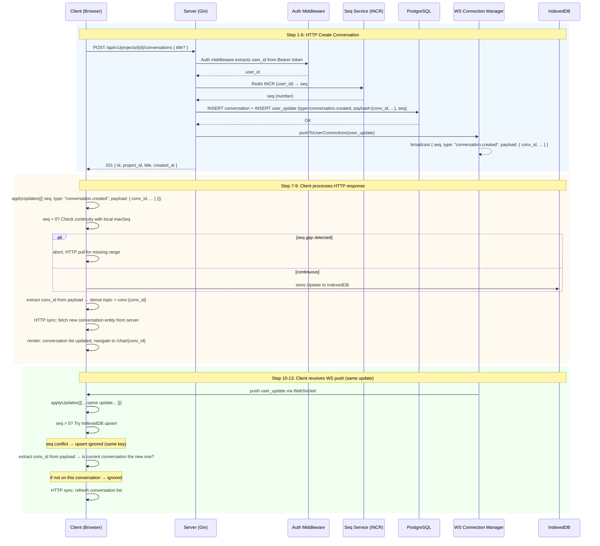
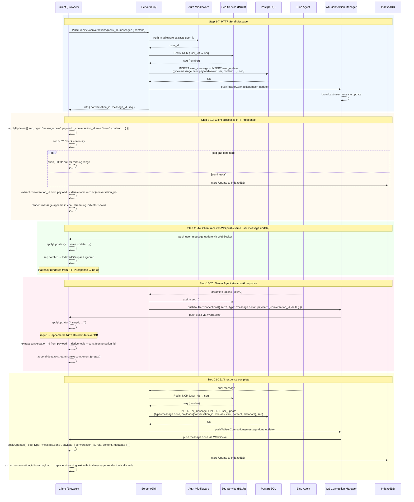
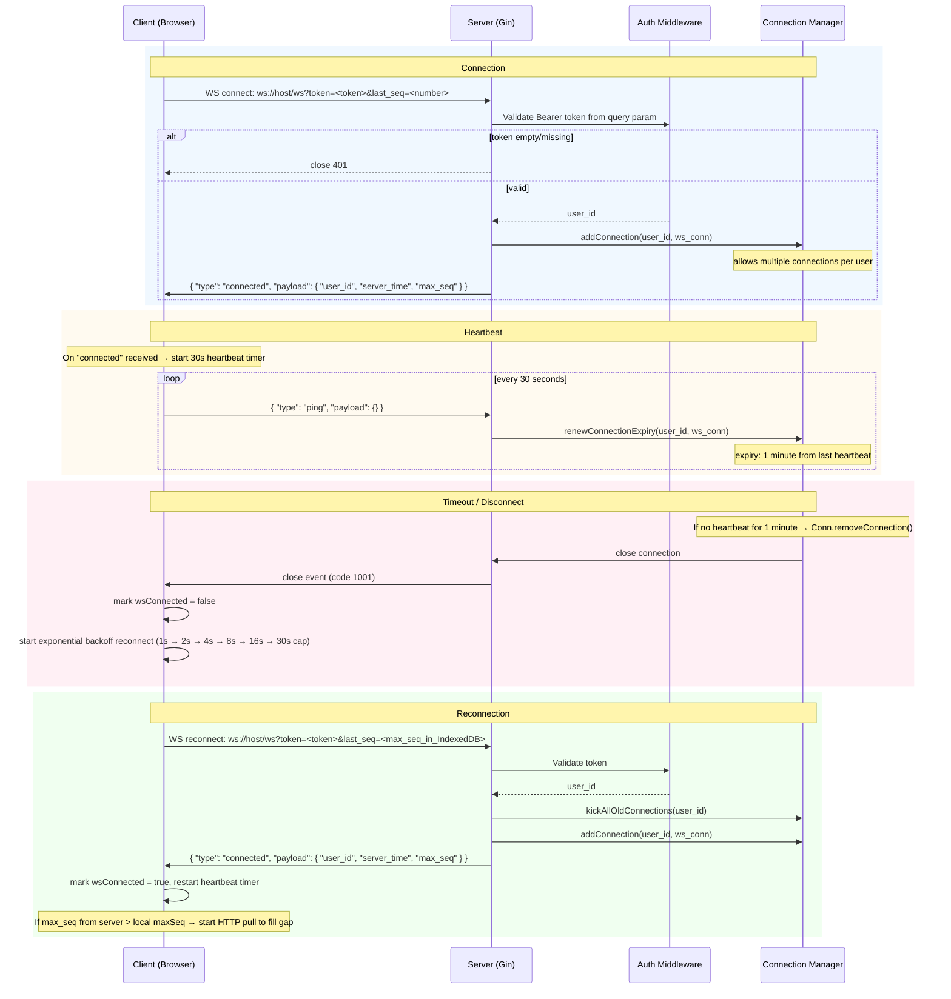
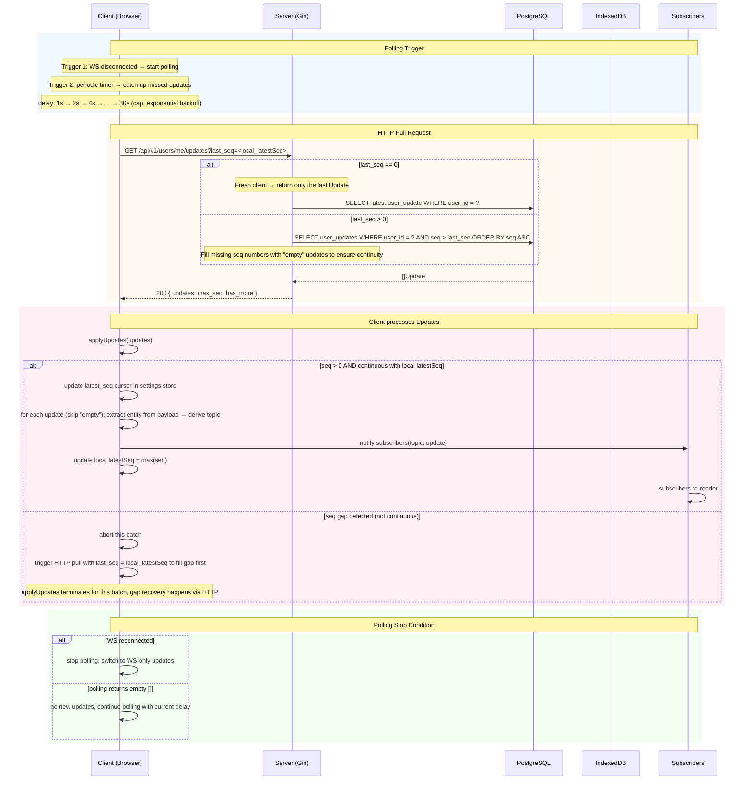
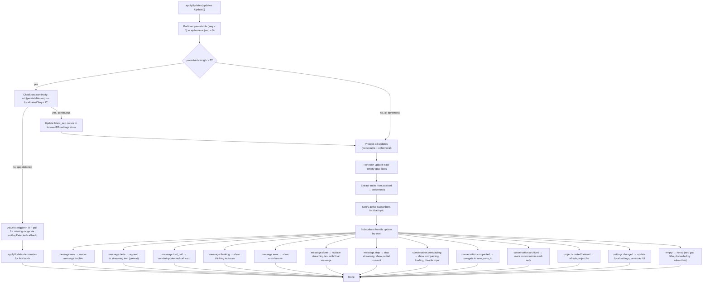
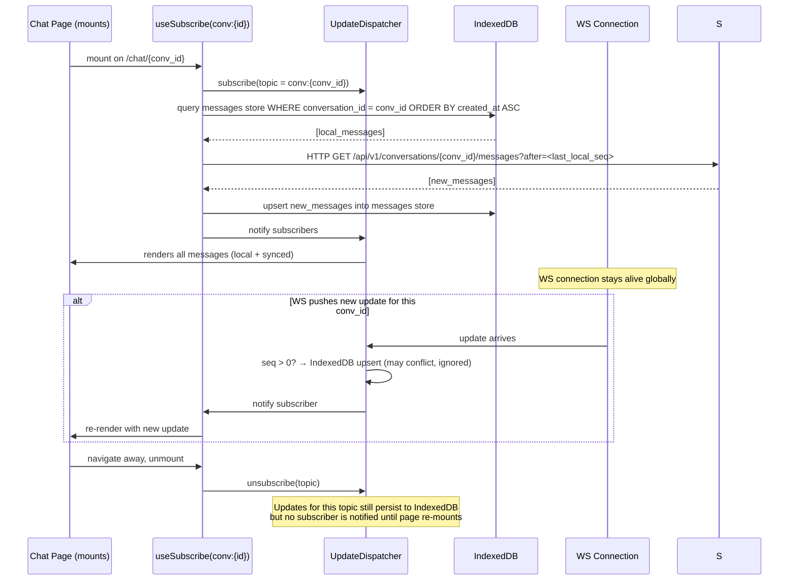

# API Final Specification

> **Status**: Final
> **Version**: v1
> **Base URL**: `http(s)://host:port`
> **API Prefix**: `/api/v1`
> **OpenAPI Source**: `openapi/spec.yaml`
> **Generated Types**: `web/src/types/api.d.ts`, `server/internal/types/types.go` (via `openapi/generate.sh`)

---

## Table of Contents

1. [Core Principles](#core-principles)
2. [Design Rules](#design-rules)
3. [Authentication](#authentication)
4. [Error Response Shape](#error-response-shape)
5. [The Update Type](#the-update-type)
6. [Frontend Architecture](#frontend-architecture)
7. [Communication Flows](#communication-flows)

---

## Core Principles

- **HTTP** = client-initiated requests. All resource CRUD and user actions go through HTTP.
- **WebSocket** = server-initiated pushes. Server pushes streaming updates, notifications, and events to the client.
- **Client MUST NOT send any WebSocket frame except `ping` (heartbeat).** All client actions (send message, stop, reconnect) are HTTP endpoints.
- The same `Update` type flows through both WS pushes and HTTP polling responses. One `applyUpdates()` pipeline on the frontend.
- Single entry point: `applyUpdates(updates: Update[])` -- ALL incoming updates (WS push or HTTP polling) go through this.
- `seq > 0` → persist to IndexedDB first, then notify subscribers.
- `seq = 0` → ephemeral (streaming tokens, thinking). NOT persisted. Final `seq > 0` message supersedes.

---

## Design Rules

### Path Style

- RESTful resource paths (`/api/v1/projects`, `/api/v1/conversations`).
- Action-oriented operations use verb suffixes: `POST /api/v1/conversations/{id}/messages`, `POST /api/v1/conversations/{id}/stop`.
- RPC-style verbs in paths (`/project.create`) are forbidden.

### send_message Strategy

- `POST /api/v1/conversations/{id}/messages` returns synchronously with `{ conversation_id, message_id, seq }` for the user's message only.
- The AI response (streaming tokens, tool calls, final message) flows exclusively through WebSocket pushes as `[]Update` arrays.
- If WS is disconnected, client falls back to HTTP polling endpoint.

### Offline Polling

- Returns `{ updates: [...], max_seq, has_more }` — the server fills missing seq numbers with `empty` updates.
- Client passes `updates` array into `applyUpdates()`. The `empty` updates are skipped by the subscriber notifier.

### WebSocket Frame Envelope

- Single envelope type -- all frames share `{ "type": string, "payload": object }`.
- Server → Client frames: `updates` (batched `[]Update`), `connected` (WS handshake), and future types.
- Client → Server frames: `ping` (heartbeat) only.
- No client message, stop, or reconnect frames via WebSocket. Those are HTTP endpoints.

### Type Generation

```bash
./openapi/generate.sh
```

Generates both Go (`server/internal/types/types.go`) and TypeScript (`web/src/types/api.d.ts`) types from `openapi/spec.yaml`.

**All API and WebSocket payloads must reference the generated types.** Never hand-write field names that exist in the spec — this is the only way to guarantee field-name consistency between backend and frontend.

---

## Authentication

- All `/api/v1/` endpoints require `Authorization: Bearer <token>`.
- In demo mode, `<token>` value IS the `user_id`. Any non-empty token is accepted.
- WebSocket auth uses query param: `ws://host/ws?token=<token>&last_seq=<number>`.
- Missing or empty token: `401 Unauthorized`.

---

## Error Response Shape

```json
{
  "error": {
    "code": "ERROR_CODE",
    "message": "human readable description"
  }
}
```

| HTTP Status | Code | When |
| --- | --- | --- |
| 400 | `INVALID_REQUEST` | Malformed JSON, missing required fields, invalid enum values |
| 400 | `NOT_FOUND` | Referenced resource (project, conversation) does not exist |
| 401 | `UNAUTHORIZED` | Missing or empty Authorization header |
| 404 | `NOT_FOUND` | Endpoint path does not match any route |
| 500 | `INTERNAL_ERROR` | Unexpected server error |

No stack traces or internal details are ever leaked.

### UI Treatment

| Error Code | UI Treatment |
| --- | --- |
| `INVALID_REQUEST` | `message.error(message)` -- user input error |
| `NOT_FOUND` | `Result` page with "not found" + back button, or `message.warning` for list ops |
| `UNAUTHORIZED` | Redirect to login, clear token |
| `INTERNAL_ERROR` | `message.error('Something went wrong. Please try again.')` |

---

## The Update Type

Every server-to-client event (both WS pushes and HTTP polling responses) is an `Update`:

```json
{
  "seq": 0,
  "type": "message.new",
  "payload": {}
}
```

| Field | Type | Required | Description |
| --- | --- | --- | --- |
| `seq` | number | yes | `> 0` = persisted (stored in DB, replayable on reconnect, stored in IndexedDB). `0` = ephemeral (streaming token, thinking chunk), NOT persisted, NOT replayable. |
| `type` | string | yes | Discriminator. See Update Types below. |
| `payload` | object | yes | Type-specific entity. Frontend extracts entity fields (e.g. `conversation_id`) from payload to derive topic. |

### Update Types

| `type` | `seq > 0` | `seq = 0` | Payload Shape |
| --- | --- | --- | --- |
| `message.new` | Message persisted (user or AI) | -- | payload contains conversation context + `sender`, `content`, etc. |
| `message.delta` | -- | Streaming text token appended | payload contains conversation context + `delta` |
| `message.done` | Final message with complete content | -- | payload contains conversation context + `content`, `metadata` |
| `message.tool_call` | Tool call record persisted | -- | payload contains conversation context + tool fields |
| `message.thinking` | -- | Thinking/reasoning token | payload contains conversation context + `delta` |
| `message.error` | Error event persisted | -- | payload contains conversation context + error fields |
| `message.stop` | Stream interrupted by user | -- | payload contains conversation context + partial `content` |
| `conversation.created` | Conversation created | -- | payload contains `conversation_id`, `project_id` |
| `conversation.deleted` | Conversation deleted | -- | payload contains `conversation_id` |
| `conversation.compacting` | Compression started | -- | payload contains `conversation_id` |
| `conversation.compacted` | Compression completed | -- | payload contains `old_conv_id`, `new_conv_id` |
| `conversation.archived` | Conversation archived | -- | payload contains `conversation_id` |
| `project.created` | Project created | -- | payload contains `project_id`, `template_id` |
| `project.deleted` | Project deleted | -- | payload contains `project_id` |
| `settings.changed` | Settings updated | -- | payload contains `model_tier`, `locale`, or `theme` |
| `empty` | `> 0` | -- | `{}` (seq gap filler) |

### TypeScript Discriminated Union

```typescript
type Update = MessageNewUpdate | MessageDeltaUpdate | MessageDoneUpdate
  | MessageToolCallUpdate | MessageThinkingUpdate | MessageErrorUpdate | MessageStopUpdate
  | ConversationCreatedUpdate | ConversationDeletedUpdate
  | ConversationCompactingUpdate | ConversationCompactedUpdate | ConversationArchivedUpdate
  | ProjectCreatedUpdate | ProjectDeletedUpdate
  | SettingsChangedUpdate
  | EmptyUpdate;
```

### Seq Assignment

- Server assigns monotonically increasing `seq` per user via Redis `INCR` command.
- `seq = 0` = server assigns zero for ephemeral events (streaming tokens).
- **Gap filling**: `INCR` runs before DB write. If the DB write fails, the seq is not rolled back, creating gaps in the sequence. Before returning `[]Update` to client (HTTP response or polling), server fills missing seq numbers with `empty` updates so the frontend's seq continuity check always passes. For example: client sends `last_seq=100`, server max_seq=200. Server queries `seq > 100`, expects 101–200. Actual DB rows may be sparse (e.g. 102, 105, 106…200). Server inserts `empty` updates for every missing seq (101, 103, 104, 107…) so the client receives a continuous range.

---

## Frontend Architecture

### UpdateDispatcher (singleton)

- `applyUpdates(updates: Update[])` -- single entry point for all updates. Thread-safe: concurrent calls are serialized via a mutex/queue.
- Partitions into `persistable (seq > 0)` and `ephemeral (seq = 0)`.
- For persistable: validates seq continuity against `latest_seq` cursor. If gap detected, triggers HTTP pull for the
  missing range and discards the current batch. If continuous, updates the `latest_seq` cursor.
- For ephemeral: no IndexedDB write, no seq check.
- **IndexedDB strategy**: `applyUpdates()` does NOT write to a dedicated `updates` store. Only `latest_seq` (a single
  integer in the `settings` store) tracks the global sync cursor. If missed during disconnect, `latest_seq` + HTTP pull
  recovers missing entities. Other entities (messages, conversations, projects) are stored in separate IndexedDB tables
  via HTTP sync after subscribers are notified.

### Topic Routing

- Derived from route context: `/chat/{convId}` → `conv:{convId}`.
- System-level updates (no conversation entity in payload) → `system` topic.
- Backend has no topic concept. Frontend extracts entity fields from `payload` to derive topic.

### Connection Lifecycle

- WS connects once on auth. App-global, never disconnect on page nav.
- On reconnect, server actively closes (kicks) all old connections for this user before adding the new one. Heartbeat expiry is per-connection (1 minute from last heartbeat).
- On reconnect, HTTP polling endpoint fills gaps until WS is stable.
- All client actions (send, stop, reconnect) via HTTP endpoints. WS is receive-only.

### `applyUpdates()` Flow

```text
1. Partition: persistable (seq > 0) vs ephemeral (seq = 0)
2. For persistable: check seq continuity with local latest_seq
   - If gap detected: trigger HTTP pull for missing range (via onGapDetected callback), discard current batch
   - If continuous: update latest_seq cursor in IndexedDB settings store
3. For ephemeral: skip IndexedDB
4. For each update (skip "empty" gap-fillers): extract entity from payload → derive topic
5. Notify active subscribers for that topic
```

### IndexedDB Schema

- Store name: `settings` — contains `latest_seq` cursor (single integer).
- Additional stores (populated via HTTP sync, not by `applyUpdates()`): `messages`, `conversations`, `projects`, `users`.
- Chat page flush: queries IndexedDB `messages` store for the current conversation. Missing data triggers HTTP sync, which updates local tables and then re-renders.

### Flow

```text
source → applyUpdates → (seq>0: update latest_seq cursor) → (skip empty updates) → notify subscribers → component re-render
```

---

## Communication Flows

### Flow 1: Create Conversation



---

### Flow 2: Send Message



---

### Flow 3: WebSocket Connection Lifecycle



---

### Flow 4: Client Pulls Updates (Polling Fallback)



---

### Flow 5: applyUpdates() Complete Flow



---

### Flow 6: Page Mount + Flush Pending Updates



---

## Summary of Server Push Types

| `type` | `seq` | Triggered By | Sent Via |
| --- | --- | --- | --- |
| `message.new` | `> 0` | Message persisted (user or AI) | WS + HTTP response |
| `message.delta` | `0` | Agent streaming token | WS only |
| `message.done` | `> 0` | Agent response complete | WS |
| `message.tool_call` | `> 0` | Tool execution result | WS |
| `message.thinking` | `0` | Model reasoning token | WS only |
| `message.error` | `> 0` | Agent or system error | WS |
| `message.stop` | `> 0` | User interrupted stream | WS |
| `conversation.created` | `> 0` | New conversation started | WS + HTTP response |
| `conversation.deleted` | `> 0` | Conversation deleted | WS |
| `conversation.compacting` | `> 0` | Context compression started | WS |
| `conversation.compacted` | `> 0` | Compression completed | WS |
| `conversation.archived` | `> 0` | Conversation archived | WS |
| `project.created` | `> 0` | Project created from template | WS + HTTP response |
| `project.deleted` | `> 0` | Project deleted | WS |
| `settings.changed` | `> 0` | Settings updated | WS |
| `empty` | `> 0` | Seq gap filler (INCR non-rollback) | WS + HTTP response |
| `connected` | -- | WS connection established | WS only (WSServerFrame, not Update) |
