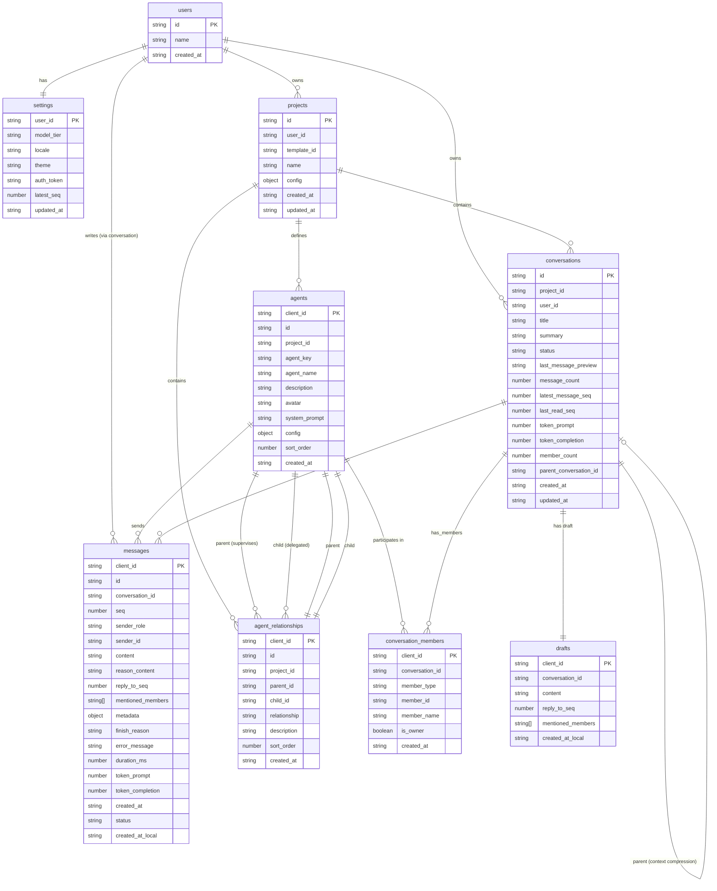

# IndexedDB Database Schema

## Design Principles

- **No event log store**: Unlike PostgreSQL's `user_updates` table, IndexedDB does NOT persist the Update event stream. Only `latest_seq` in `settings` tracks the global sync cursor. This eliminates seq gap-filling logic, storage cleanup complexity, and IndexedDB write overhead. Updates are consumed in real-time: receive → sync entities → persist → notify subscribers → discard.
- **Server-aligned entity tables**: `users`, `projects`, `conversations` mirror PostgreSQL column-for-column. This simplifies HTTP sync — upsert full entity rows without field mapping or transformation.
- **Client-extended messages table**: `messages` includes `client_id` (front-end generated UUID) and `status` lifecycle field. Client-side messages exist before the server assigns `id` and `seq`, so `client_id` is the primary key. This covers the full lifecycle: sending → sent → delivered → failed.
- **Drafts as standalone store**: `drafts` preserves unsent message content. Prevents data loss on tab close, supports retry after send failure, and carries `mentioned_members` from draft to message on submission.
- **No cleanup policy**: Messages are NOT auto-pruned. When the user deletes a conversation, cascade-delete its messages. Storage management is user-driven, not application-driven.
- **No IndexedDB foreign keys**: IndexedDB does not enforce FK constraints. Relationships are maintained by application code (HTTP sync upserts, cascade deletes in JS).
- **`latest_seq` in settings**: A single `number` field in the `settings` table serves as the global sync cursor. On WebSocket reconnect, client sends `latest_seq` to the server. Server returns `seq > latest_seq` updates. Client checks `update.seq === latest_seq + 1` for continuity.

---

## Table Definitions

### `users`

| Column | Type | Constraints | Description |
| --- | --- | --- | --- |
| `id` | string (UUID) | PK | User identifier. Mirrors PostgreSQL `users.id` |
| `name` | string | NOT NULL | Display name. Mirrors PostgreSQL `users.name` |
| `created_at` | string | NOT NULL | Account creation time (ISO-8601). Mirrors PostgreSQL `users.created_at` |

**Design notes**:
- Only the current user's row is stored. This is a single-row cache, not a full user directory.
- Needed for UI display (avatar name, profile page) without requiring an HTTP round-trip.

---

### `settings`

| Column | Type | Constraints | Description |
| --- | --- | --- | --- |
| `user_id` | string (UUID) | PK | Settings owner. Mirrors PostgreSQL `settings.user_id` |
| `model_tier` | string | NOT NULL, DEFAULT `'sonnet'` | Active model tier: `'haiku'` \| `'sonnet'` \| `'opus'`. Mirrors PostgreSQL `settings.model_tier` |
| `locale` | string | NOT NULL, DEFAULT `'en'` | User language: `'en'` \| `'zh'`. Mirrors PostgreSQL `settings.locale` |
| `theme` | string | NOT NULL, DEFAULT `'light'` | UI theme: `'light'` \| `'dark'`. Mirrors PostgreSQL `settings.theme` |
| `auth_token` | string | NOT NULL | Demo-mode auth token (token value IS the user_id). **Frontend-only**: not stored in PostgreSQL, managed client-side |
| `latest_seq` | number | NOT NULL, DEFAULT `0` | Global sync cursor. Tracks the highest `seq` consumed from the server's Update event stream. **Frontend-only**: replaces the need for a persisted `updates` event log table |
| `updated_at` | string | NOT NULL | Last settings change time (ISO-8601). Mirrors PostgreSQL `settings.updated_at` |

**Design notes**:
- Consolidates user preferences + auth state + sync cursor into a single row-per-user table. This eliminates the need for a separate `sync_state` or `client_state` table.
- `auth_token` lives here instead of `localStorage` so that all user-scoped state is unified in one IndexedDB transaction. User switch → delete this row → clean slate.
- `latest_seq` replaces the entire `updates` event log. On reconnect: send `latest_seq` → server returns `seq > latest_seq` updates → client checks continuity (`update.seq === latest_seq + 1`) → consume → bump `latest_seq`.
- Upsert pattern: always a single row, `put()` by `user_id`.

---

### `projects`

| Column | Type | Constraints | Description |
| --- | --- | --- | --- |
| `id` | string (UUID) | PK | Project identifier. Mirrors PostgreSQL `projects.id` |
| `user_id` | string (UUID) | NOT NULL | Project owner. Mirrors PostgreSQL `projects.user_id` |
| `template_id` | string | NOT NULL | Template reference. Mirrors PostgreSQL `projects.template_id` |
| `name` | string | NOT NULL | Project display name. Mirrors PostgreSQL `projects.name` |
| `config` | object | NOT NULL | Template-specific JSON config. Mirrors PostgreSQL `projects.config` (JSONB) |
| `created_at` | string | NOT NULL | Creation time (ISO-8601). Mirrors PostgreSQL `projects.created_at` |
| `updated_at` | string | NOT NULL | Last modification time (ISO-8601). Mirrors PostgreSQL `projects.updated_at` |

**Index**: `(user_id)` — powers "list user's projects" query.

**Design notes**:
- Column-for-column mirror of PostgreSQL. HTTP sync returns full project objects → direct `put()` into IndexedDB. No field transformation.
- `config` is `object` (not typed columns) because each template has a different configuration structure.

---

### `conversations`

| Column | Type | Constraints | Description |
| --- | --- | --- | --- |
| `id` | string (UUID) | PK | Conversation identifier. Mirrors PostgreSQL `conversations.id` |
| `project_id` | string (UUID) | NOT NULL | Parent project. Mirrors PostgreSQL `conversations.project_id` |
| `user_id` | string (UUID) | NOT NULL | Owner. Mirrors PostgreSQL `conversations.user_id` |
| `title` | string | NOT NULL | Conversation title. Mirrors PostgreSQL `conversations.title` |
| `summary` | string | NOT NULL | LLM summary carried forward during context compression. Mirrors PostgreSQL `conversations.summary` |
| `status` | string | NOT NULL | Lifecycle: `'active'` \| `'compacting'` \| `'compacted'` \| `'archived'`. Mirrors PostgreSQL `conversations.status` |
| `last_message_preview` | string \| null | NULL | Latest message preview text. Mirrors PostgreSQL `conversations.last_message_preview` |
| `message_count` | number | NOT NULL | Total message count. Mirrors PostgreSQL `conversations.message_count` |
| `latest_message_seq` | number | NOT NULL | Highest per-conversation message seq. Mirrors PostgreSQL `conversations.latest_message_seq` |
| `last_read_seq` | number | NOT NULL, DEFAULT `0` | **Frontend-only.** The `seq` the user last viewed in this conversation. Unread count = `Math.max(0, latest_message_seq - last_read_seq)`. Resets to `latest_message_seq` when the user opens the chat page |
| `token_prompt` | number | NOT NULL | Accumulated prompt tokens. Mirrors PostgreSQL `conversations.token_prompt` |
| `token_completion` | number | NOT NULL | Accumulated completion tokens. Mirrors PostgreSQL `conversations.token_completion` |
| `member_count` | number | NOT NULL | Number of participants. Mirrors PostgreSQL `conversations.member_count` |
| `parent_conversation_id` | string (UUID) \| null | NULL | Reference after context compression. Mirrors PostgreSQL `conversations.parent_conversation_id` |
| `created_at` | string | NOT NULL | Creation time (ISO-8601). Mirrors PostgreSQL `conversations.created_at` |
| `updated_at` | string | NOT NULL | Last activity time (ISO-8601). Mirrors PostgreSQL `conversations.updated_at` |

**Indexes**:
- `(project_id)` — filter by project
- `(user_id, updated_at)` — list user's conversations sorted by recent activity
- `(user_id, status)` — filter by status (e.g. only `active`)

**Design notes**:
- Full mirror of PostgreSQL for seamless HTTP sync. No field mapping needed.
- `updated_at` is used for sorting the conversation list (most recent first).
- `status` drives UI state: `compacting` → show loading, disable input; `archived` → read-only view; `compacted` → navigate to new conversation.

---

### `messages`

| Column | Type | Constraints | Description |
| --- | --- | --- | --- |
| `client_id` | string | PK | **Frontend-generated UUID.** Primary key from creation. Identifies the message before the server assigns `id` |
| `id` | string (UUID) \| null | NULL | Server-assigned UUID after successful delivery. Mirrors PostgreSQL `messages.id` |
| `conversation_id` | string (UUID) | NOT NULL | Parent conversation. Mirrors PostgreSQL `messages.conversation_id` |
| `seq` | number \| null | NULL | Server-assigned per-conversation sequence number. Mirrors PostgreSQL `messages.seq` |
| `sender_role` | string | NOT NULL | `'user'` \| `'assistant'` \| `'system'` \| `'tool'`. Mirrors PostgreSQL `messages.sender_role` |
| `sender_id` | string | NOT NULL | Specific sender identifier. Mirrors PostgreSQL `messages.sender_id` |
| `content` | string | NOT NULL | Primary message text (Markdown for assistant). Mirrors PostgreSQL `messages.content` |
| `reason_content` | string | NOT NULL | Thinking/reasoning process. Mirrors PostgreSQL `messages.reason_content` |
| `reply_to_seq` | number \| null | NULL | Seq of the message being replied to. Mirrors PostgreSQL `messages.reply_to_seq` |
| `mentioned_members` | string[] \| null | NULL | Array of @mentioned `sender_id`s. Mirrors PostgreSQL `messages.mentioned_members` |
| `metadata` | object | NOT NULL | Tool calls, model name, cost, etc. Mirrors PostgreSQL `messages.metadata` (JSONB) |
| `finish_reason` | string \| null | NULL | Why the model stopped. Mirrors PostgreSQL `messages.finish_reason` |
| `error_message` | string \| null | NULL | Error text on failure. Mirrors PostgreSQL `messages.error_message` |
| `duration_ms` | number \| null | NULL | Response latency. Mirrors PostgreSQL `messages.duration_ms` |
| `token_prompt` | number | NOT NULL | Prompt tokens for this message. Mirrors PostgreSQL `messages.token_prompt` |
| `token_completion` | number | NOT NULL | Completion tokens for this message. Mirrors PostgreSQL `messages.token_completion` |
| `created_at` | string | NOT NULL | Server creation time (ISO-8601). Mirrors PostgreSQL `messages.created_at` |
| `status` | string | NOT NULL | **Frontend-only.** Send lifecycle: `'sending'` \| `'sent'` \| `'delivered'` \| `'failed'` |
| `created_at_local` | string | NOT NULL | **Frontend-only.** Local creation time (ISO-8601), set when user clicks send |

**Index**: `(conversation_id, created_at_local)` — render messages ordered by time within a conversation.

**Design notes**:
- **`client_id` as PK**: Messages exist on the client before the server acknowledges them. `client_id` is generated at send time (e.g. `crypto.randomUUID()`). After the server responds with `id` and `seq`, these are backfilled into the same row via `put()`.
- **`status` lifecycle**:
  - `'sending'` → HTTP POST in progress. UI shows spinner.
  - `'sent'` → Server acknowledged (200 response with `id`/`seq`). UI shows checkmark.
  - `'delivered'` → WS push of `message.done` confirmed the full AI response. Row updated with server data.
  - `'failed'` → HTTP POST failed (network error, 500). UI shows error + retry button. Retry re-sets to `'sending'`.
- **`created_at_local`**: Ensures correct chronological ordering even when server timestamps are slightly out of sync (e.g. due to clock skew or network delay). Client messages appear in the order the user sent them.
- **Server messages** (assistant/system/tool): These arrive via WS push or HTTP sync, not from client sending. They get a `client_id` generated at sync time for PK consistency, but `status` is immediately `'delivered'`.
- **No cleanup policy**: Messages are NOT auto-deleted. When the user deletes a conversation, application code must cascade-delete all messages with matching `conversation_id`.

---

### `drafts`

| Column | Type | Constraints | Description |
| --- | --- | --- | --- |
| `client_id` | string | PK | **Frontend-generated UUID.** Identifies the draft |
| `conversation_id` | string (UUID) | NOT NULL | Parent conversation. Links to `conversations.id` |
| `content` | string | NOT NULL | Draft message content. May contain partial text, Markdown, or `@mentions` |
| `reply_to_seq` | number \| null | NULL | If this draft is a reply to a specific message, the `seq` of that message |
| `mentioned_members` | string[] \| null | NULL | Array of `sender_id`s that the draft @mentions. Carried forward to `messages.mentioned_members` on send |
| `created_at_local` | string | NOT NULL | Draft creation time (ISO-8601) |

**Index**: `(conversation_id)` — load draft for a specific conversation when navigating to the chat page.

**Design notes**:
- **Purpose**: Prevents data loss on tab close / accidental navigation / browser crash. Supports retry after send failure.
- **Auto-save**: Draft is saved on every keystroke (debounced 500ms) or when the user navigates away from the chat page.
- **Lifecycle**:
  - User types → debounce save → `drafts.put()`
  - User sends → on success: delete draft, create `messages` row
  - User sends → on failure: draft preserved, user can retry or edit
  - User clears input → `drafts.delete(client_id)`
  - User navigates away → draft persists for next visit to this conversation
- **One draft per conversation**: In practice, a conversation has at most one active draft. `client_id` as PK allows multiple drafts theoretically, but the UI only exposes one input box per conversation.
- **`mentioned_members`**: Users can `@mention` agents in the draft. This field carries over to the `messages` table on successful send. No separate lookup needed.
- **Not synced to server**: Drafts are purely client-side. No PostgreSQL equivalent.

---

### `conversation_members`

| Column | Type | Constraints | Description |
| --- | --- | --- | --- |
| `client_id` | string | PK | **Frontend-generated UUID.** Identifies the membership row |
| `conversation_id` | string (UUID) | NOT NULL | Parent conversation. Links to `conversations.id` |
| `member_type` | string | NOT NULL | `'user'` \| `'agent'`. Separates end users from AI agents for UI rendering and query filtering |
| `member_id` | string | NOT NULL | Unique member identifier. For `user` type: user UUID. For `agent` type: agent name (e.g. `"agent_basic"`, `"agent_supervisor"`) |
| `member_name` | string | NOT NULL | Display name. User's chosen name or Agent's display name |
| `is_owner` | boolean | NOT NULL | Whether this member initiated the conversation. Exactly one user per conversation has `is_owner = TRUE` |
| `created_at` | string | NOT NULL | Join time (ISO-8601). When the member was added to the conversation |

**Index**: `(conversation_id)` — query "who are the members of this conversation".

**Design notes**:

- **Full mirror of PostgreSQL `conversation_members`** (except `client_id` as PK). Synced alongside `conversations` via HTTP sync.
- **Purpose**: UI renders participant list in chat header, enables `@mention` autocomplete, distinguishes user from agent messages via `sender_role` + `sender_id` in the `messages` table.
- **Multi-Agent scenarios**: A Supervisor conversation has `user` (is_owner=TRUE) + `agent_supervisor` + `agent_basic` + `agent_deep` = 4 rows. All queryable from this table.
- **Lifecycle**: Created when a conversation is initialized. Deleted when the conversation is deleted (cascade). Not modified during the conversation's lifetime (members are static for a session).
- **`member_count` derivation**: `conversations.member_count` is cached by the backend via `SELECT COUNT(*)`. Frontend can trust the cached value or count rows for real-time accuracy.

---

### `agents`

| Column | Type | Constraints | Description |
| --- | --- | --- | --- |
| `client_id` | string | PK | **Frontend-generated UUID.** Identifies the agent row |
| `id` | string (UUID) \| null | NULL | Server-assigned UUID after creation. Mirrors PostgreSQL `agents.id` |
| `project_id` | string (UUID) | NOT NULL | Parent project. Mirrors PostgreSQL `agents.project_id` |
| `agent_key` | string | NOT NULL | Unique key within the project (e.g. `"basic"`, `"supervisor"`). Used as `messages.sender_id` and `conversation_members.member_id`. Mirrors PostgreSQL `agents.agent_key` |
| `agent_name` | string | NOT NULL | Display name shown in chat UI. Mirrors PostgreSQL `agents.agent_name` |
| `description` | string | NOT NULL | Agent purpose description, shown in educational context. Mirrors PostgreSQL `agents.description` |
| `avatar` | string | NOT NULL | Icon/avatar identifier for UI rendering. Mirrors PostgreSQL `agents.avatar` |
| `system_prompt` | string | NOT NULL | Agent-specific system prompt. Mirrors PostgreSQL `agents.system_prompt` |
| `config` | object | NOT NULL | Agent runtime config: model tier, tool list, temperature, etc. Mirrors PostgreSQL `agents.config` (JSONB) |
| `sort_order` | number | NOT NULL | Display order in the conversation members list. Mirrors PostgreSQL `agents.sort_order` |
| `created_at` | string | NOT NULL | Creation time (ISO-8601). Mirrors PostgreSQL `agents.created_at` |

**Index**: `(project_id)` — list agents for a project.

**Design notes**:

- **Full mirror of PostgreSQL `agents`** (plus `client_id` as PK for creation flow). Agents exist before any conversation is created.
- **`id` nullable**: When the user creates a project from a template, agents are created on the server and returned. But the client may render the agent list before the server responds, using `client_id` temporarily.
- **Purpose**: Agent config display in project detail page, `@mention` autocomplete data source, message sender label lookup, educational context for understanding each Agent's role.
- **`agent_key` linkage**: When an agent runs, its `sender_id` in `messages` matches this key. This connects runtime messages back to their definition.

---

### `agent_relationships`

| Column | Type | Constraints | Description |
| --- | --- | --- | --- |
| `client_id` | string | PK | **Frontend-generated UUID.** Identifies the relationship row |
| `id` | string (UUID) \| null | NULL | Server-assigned UUID. Mirrors PostgreSQL `agent_relationships.id` |
| `project_id` | string (UUID) | NOT NULL | Parent project. Mirrors PostgreSQL `agent_relationships.project_id` |
| `parent_id` | string (UUID) | NOT NULL | Parent/supervising agent. References `agents.id`. Mirrors PostgreSQL `agent_relationships.parent_id` |
| `child_id` | string (UUID) | NOT NULL | Child/delegated agent. References `agents.id`. Mirrors PostgreSQL `agent_relationships.child_id` |
| `relationship` | string | NOT NULL | Relationship description (e.g. `"delegates"`, `"supervises"`). Free text, no enum constraint. Mirrors PostgreSQL `agent_relationships.relationship` |
| `description` | string | NOT NULL | Human-readable explanation of this relationship, shown in educational context. Mirrors PostgreSQL `agent_relationships.description` |
| `sort_order` | number | NOT NULL | Display order in the Agent tree. Mirrors PostgreSQL `agent_relationships.sort_order` |
| `created_at` | string | NOT NULL | Creation time (ISO-8601). Mirrors PostgreSQL `agent_relationships.created_at` |

**Index**: `(project_id)`, `(parent_id)`, `(child_id)` — bidirectional queries for traversing the Agent tree.

**Design notes**:

- **Full mirror of PostgreSQL `agent_relationships`** (plus `client_id` as PK). Synced alongside `projects` via HTTP sync.
- **Tree structure**: A Supervisor project has `parent_id → supervisor agent`, multiple `child_id → delegated agents`. Recursively renders the Agent tree in the project detail page.
- **No FK enforcement**: IndexedDB does not enforce foreign keys. Application code ensures `parent_id` and `child_id` reference existing `agents` rows.
- **Purpose**: Agent topology visualization in project detail page, understanding multi-agent delegation patterns, educational context for learners.

---

## Entity Relationship Diagram



---

## Index Summary

| Table | Index | Type | Purpose |
| --- | --- | --- | --- |
| `projects` | `(user_id)` | normal | List user's projects |
| `conversations` | `(project_id)` | normal | Filter by project |
| `conversations` | `(user_id, updated_at)` | composite | List user's conversations sorted by recent activity |
| `conversations` | `(user_id, status)` | composite | Filter by status (active / archived) |
| `messages` | `(conversation_id, created_at_local)` | composite | Render messages ordered by time within a conversation |
| `drafts` | `(conversation_id)` | normal | Load draft when navigating to a conversation |
| `conversation_members` | `(conversation_id)` | normal | Query participant list for @mention autocomplete and UI |
| `agents` | `(project_id)` | normal | List agents for a project |
| `agent_relationships` | `(project_id)` | normal | Filter relationships by project |
| `agent_relationships` | `(parent_id)` | normal | Find children of an agent (supervisor view) |
| `agent_relationships` | `(child_id)` | normal | Find parent of an agent (reverse lookup) |

---

## Sync Flow

```
WebSocket push / HTTP response → Update
    │
    ├── seq > latest_seq + 1 → gap detected → HTTP pull for missing range
    │
    └── seq == latest_seq + 1 → continuous
         │
         ├── extract entity from Update payload
         │    (conversation_id → conversation, message, etc.)
         │
         ├── HTTP sync: fetch latest entity data from server
         │
         ├── upsert into corresponding IndexedDB table
         │
         ├── latest_seq = update.seq (settings table)
         │
         └── notify topic subscribers → component re-render
```

**Key**: `latest_seq` is updated **only after** the entity is successfully persisted to IndexedDB. This ensures that if a sync fails, `latest_seq` is NOT advanced, and the next reconnect will re-fetch the same updates.

---

## Dexie.js — IndexedDB Framework

### Decision

**Framework**: [Dexie.js](https://dexie.org/)

**Database name**: `eino-client`, version: `1`.

### Why Dexie

| Criterion | Dexie | 原生 IndexedDB | `idb` (Jake Archibald) |
| --- | --- | --- | --- |
| TypeScript 类型安全 | 表定义即类型 | 需手动断言 | 需手动断言 |
| 批量操作 | `bulkPut()` / `bulkDelete()` 一行搞定 | 逐条操作，手动事务 | 逐条操作，手动事务 |
| 事务管理 | 自动，支持跨 store 事务 | 手动 `onsuccess`/`onerror` | 手动 |
| 版本迁移 | `db.version(n).stores({...})` | 手动处理 `onupgradeneeded` | 手动处理 |
| 体积 (gzip) | ~8 KB | 0 KB（浏览器内置） | ~3 KB |
| 查询能力 | 完整：where, anyOf, startsWith, compound keys | 完整但需游标 | 完整但需游标 |

**不选 `idb-keyval` 的原因**：只支持简单 KV，不支持索引、复合键、范围查询。`messages` 和 `conversations` 需要多索引查询。

### Core Definition Example

```typescript
// web/src/lib/db.ts
import Dexie, { type Table } from 'dexie';

export interface User { id: string; name: string; created_at: string }
export interface Settings { user_id: string; model_tier: string; locale: string; theme: string; auth_token: string; latest_seq: number; updated_at: string }
export interface Project { id: string; user_id: string; template_id: string; name: string; config: Record<string, any>; created_at: string; updated_at: string }
export interface Conversation { id: string; project_id: string; user_id: string; title: string; summary: string; status: string; last_message_preview: string | null; message_count: number; latest_message_seq: number; last_read_seq: number; token_prompt: number; token_completion: number; member_count: number; parent_conversation_id: string | null; created_at: string; updated_at: string }
export interface Message { client_id: string; id: string | null; conversation_id: string; seq: number | null; sender_role: string; sender_id: string; content: string; reason_content: string; reply_to_seq: number | null; mentioned_members: string[] | null; metadata: Record<string, any>; finish_reason: string | null; error_message: string | null; duration_ms: number | null; token_prompt: number; token_completion: number; created_at: string; status: string; created_at_local: string }
export interface Draft { client_id: string; conversation_id: string; content: string; reply_to_seq: number | null; mentioned_members: string[] | null; created_at_local: string }
export interface ConversationMember { client_id: string; conversation_id: string; member_type: string; member_id: string; member_name: string; is_owner: boolean; created_at: string }
export interface Agent { client_id: string; id: string | null; project_id: string; agent_key: string; agent_name: string; description: string; avatar: string; system_prompt: string; config: Record<string, any>; sort_order: number; created_at: string }
export interface AgentRelationship { client_id: string; id: string | null; project_id: string; parent_id: string; child_id: string; relationship: string; description: string; sort_order: number; created_at: string }

class EinoDB extends Dexie {
  users!: Table<User, string>;
  settings!: Table<Settings, string>;
  projects!: Table<Project, string>;
  conversations!: Table<Conversation, string>;
  messages!: Table<Message, string>;
  drafts!: Table<Draft, string>;
  conversationMembers!: Table<ConversationMember, string>;
  agents!: Table<Agent, string>;
  agentRelationships!: Table<AgentRelationship, string>;

  constructor() {
    super('eino-client');
    this.version(1).stores({
      users: 'id',
      settings: 'user_id',
      projects: 'id, user_id',
      conversations: 'id, project_id, [user_id+updated_at], [user_id+status]',
      messages: 'client_id, [conversation_id+created_at_local]',
      drafts: 'client_id, conversation_id',
      conversationMembers: 'client_id, conversation_id',
      agents: 'client_id, project_id',
      agentRelationships: 'client_id, project_id, parent_id, child_id',
    });
  }
}

export const db = new EinoDB();
```

### Idempotency Guarantee

All writes use Dexie's `put()` (via `bulkPut()` for batch operations), which maps to IndexedDB's `put` — an upsert operation. This means:

- Duplicate updates from WebSocket + HTTP response convergence are silently ignored (same key).
- Reconnect recovery is safe — the same updates can be applied multiple times without creating duplicates.
- No manual conflict resolution needed for the common case.
