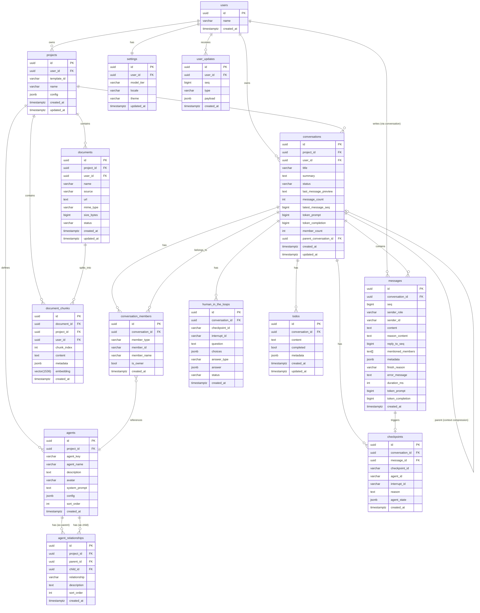

# PostgreSQL Database Schema

## Design Principles

- **UUID primary keys**: All tables use `UUID` with `gen_random_uuid()`. Avoids predictable sequential IDs, no auto-increment gaps, safe for distributed systems.
- **Foreign keys with CASCADE DELETE**: All relationships have FK constraints. Deleting a parent cascades to children — correct semantics for demo mode where orphaned data is meaningless.
- **No soft deletes**: GORM `DeletedAt` is incompatible with FK `CASCADE DELETE` (FK fires on `DELETE`, not `UPDATE SET deleted_at`). Hard deletes are correct for this scope.
- **Denormalized `user_id`**: Tables like `conversations` carry `user_id` even when `project_id → projects.user_id` exists. Avoids JOIN chains on the common "list my data" query pattern. Both FKs are enforced, consistency guaranteed at DB level.
- **`updated_at` tracking**: Updated via GORM `autoUpdateTime`, not database triggers. Simpler, avoids trigger overhead.
- **JSONB over typed columns when structure varies**: `config`, `metadata`, `agent_state`, `payload` — these fields have unpredictable, template-dependent structures. Typed columns would require `ALTER TABLE` for every new feature.
- **Typed columns over JSONB when structure is fixed**: `settings` fields (`model_tier`, `locale`, `theme`) are known and fixed. Typed columns give type safety, CHECK constraints, and query efficiency.
- **No Redis for Phase 1 LLM config**: API keys, endpoints, model mappings come from environment variables. Phase 3 adds `llm_providers` table for multi-provider dynamic switching.

---

## Table Definitions

### `users`

| Column | Type | Constraints | Description |
| --- | --- | --- | --- |
| `id` | UUID | PK, `gen_random_uuid()` | User identifier. Not the auth token — token maps to user UUID via `FirstOrCreate` in auth middleware |
| `name` | VARCHAR(255) | NOT NULL, DEFAULT `''` | Display name. Defaults to empty string (not NULL) to avoid NULL handling in app code |
| `created_at` | TIMESTAMPTZ | NOT NULL | Account creation time |

**Design notes**:
- Auth token is NOT stored in DB. Demo mode accepts any non-empty `Authorization: Bearer <token>`. The token value is used as a lookup key to find or create the user record.
- `name` defaults to empty string, not NULL — consistent with all other text columns in the schema.

---

### `projects`

| Column | Type | Constraints | Description |
| --- | --- | --- | --- |
| `id` | UUID | PK, `gen_random_uuid()` | Project identifier |
| `user_id` | UUID | NOT NULL, FK → `users(id)` ON DELETE CASCADE | Project owner |
| `template_id` | VARCHAR(32) | NOT NULL | Template identifier (e.g. `"01"`, `"02_basic_agent"`). Not a FK — templates are defined in Go code, not a DB table |
| `name` | VARCHAR(255) | NOT NULL, DEFAULT `''` | Project display name |
| `config` | JSONB | NOT NULL, DEFAULT `'{}'` | Template-specific configuration: agent settings, tool params, prompt overrides. Structure varies per template, hence JSONB |
| `created_at` | TIMESTAMPTZ | NOT NULL | Creation time |
| `updated_at` | TIMESTAMPTZ | NOT NULL | Last modification time |

**Index**: `(user_id)` — powers "list user's projects".

**Design notes**:
- Templates are Go code in `server/internal/templates/`, not DB rows. `template_id` is a string reference resolved by an in-memory registry at runtime.
- `config` is JSONB because each template has a different configuration structure (agent count, tool list, model tier, etc.). Typed columns would be over-constrained.

---

### `conversations`

| Column | Type | Constraints | Description |
| --- | --- | --- | --- |
| `id` | UUID | PK, `gen_random_uuid()` | Conversation identifier |
| `project_id` | UUID | NOT NULL, FK → `projects(id)` ON DELETE CASCADE | Parent project |
| `user_id` | UUID | NOT NULL, FK → `users(id)` ON DELETE CASCADE | Denormalized owner reference. Avoids JOIN through `projects` for "list my conversations" queries |
| `title` | VARCHAR(512) | NOT NULL, DEFAULT `''` | Conversation title. 512 chars to accommodate auto-generated titles from LLM summaries |
| `summary` | TEXT | NOT NULL, DEFAULT `''` | LLM-generated summary carried forward during context compression |
| `status` | VARCHAR(20) | NOT NULL, DEFAULT `'active'`, CHECK IN (`'active'`, `'compacting'`, `'compacted'`, `'archived'`) | Conversation lifecycle state. Required by Update event types (`conversation.compacting`, `conversation.compacted`, `conversation.archived`) for UI state management |
| `last_message_preview` | TEXT | NULL | Preview text of the latest message. Denormalized to avoid `ORDER BY created_at DESC LIMIT 1` JOIN on conversation list render |
| `message_count` | INT | NOT NULL, DEFAULT `0` | Total messages in this conversation. Denormalized, updated on each message write |
| `latest_message_seq` | BIGINT | NOT NULL, DEFAULT `0` | Highest per-conversation message `seq`. Client compares with local read-seq to detect new messages. This is per-conversation, NOT the global user `seq` from Redis |
| `token_prompt` | BIGINT | NOT NULL, DEFAULT `0` | Accumulated prompt tokens across all messages in this conversation |
| `token_completion` | BIGINT | NOT NULL, DEFAULT `0` | Accumulated completion tokens across all messages |
| `member_count` | INT | NOT NULL, DEFAULT `0` | Number of participants (users + agents). Educational value: Basic Agent = 2 (user + 1 agent), Supervisor = 5+ |
| `parent_conversation_id` | UUID | NULL, FK → `conversations(id)` | After context compression, the new conversation references the old one. Users can navigate "previous parts" of a long conversation thread |
| `created_at` | TIMESTAMPTZ | NOT NULL | Creation time |
| `updated_at` | TIMESTAMPTZ | NOT NULL | Last activity time. Used for sorting conversation list by recent activity |

**Indexes**: `(project_id)`, `(user_id)`, `(user_id, status)`.

**Design notes**:
- `latest_message_seq` is per-conversation, independent of the global user `seq`. Each message within a conversation gets an incrementing seq (1, 2, 3...). This field caches the max value.
- `token_prompt` and `token_completion` are separate columns (not JSONB) for efficient `SUM()` and `UPDATE` operations.
- `parent_conversation_id` enables conversation threading after context compression, which closes the current conversation and creates a new one with the summary carried forward.

---

### `conversation_members`

| Column | Type | Constraints | Description |
| --- | --- | --- | --- |
| `id` | UUID | PK, `gen_random_uuid()` | Membership identifier |
| `conversation_id` | UUID | NOT NULL, FK → `conversations(id)` ON DELETE CASCADE | Parent conversation |
| `member_type` | VARCHAR(10) | NOT NULL, CHECK IN (`'user'`, `'agent'`) | Member type. Separates end users from AI agents for UI rendering and query filtering |
| `member_id` | VARCHAR(255) | NOT NULL | Unique member identifier. For `user` type: user UUID. For `agent` type: agent name (e.g. `"agent_basic"`, `"agent_supervisor"`) |
| `member_name` | VARCHAR(255) | NOT NULL, DEFAULT `''` | Display name. User's chosen name or Agent's display name. Separate from `member_id` for human-readable labels |
| `is_owner` | BOOLEAN | NOT NULL, DEFAULT `FALSE` | Who initiated the conversation. Used to highlight the "host" in the UI. Exactly one user per conversation has `is_owner = TRUE` |
| `created_at` | TIMESTAMPTZ | NOT NULL | Join time. When the member was added to the conversation |

**Constraints**: UNIQUE `(conversation_id, member_type, member_id)` — same member cannot be added twice to the same conversation within the same type.

**Indexes**: `(conversation_id)` — query "who are the members of this conversation".

**Design notes**:
- Replaces a naive `member_count`-only approach. Count is derived from `SELECT COUNT(*) FROM conversation_members WHERE conversation_id = ?`, cached in `conversations.member_count` for display.
- `member_type` + `member_id` together uniquely identify a member. A user and an agent can both exist in the same conversation without conflict.
- Multi-Agent scenarios: a Supervisor conversation has `user` + `agent_supervisor` + `agent_basic` + `agent_deep` = 4 members. The membership table makes this explicit rather than buried in a counter.

---

### `agents`

| Column | Type | Constraints | Description |
| --- | --- | --- | --- |
| `id` | UUID | PK, `gen_random_uuid()` | Agent identifier |
| `project_id` | UUID | NOT NULL, FK → `projects(id)` ON DELETE CASCADE | Parent project |
| `agent_key` | VARCHAR(64) | NOT NULL | Unique key within the project (e.g. `"basic"`, `"supervisor"`, `"researcher"`). Used as `messages.sender_id` and `conversation_members.member_id` for agents |
| `agent_name` | VARCHAR(255) | NOT NULL | Display name shown in chat UI (e.g. `"Basic Agent"`, `"Research Assistant"`) |
| `description` | TEXT | NOT NULL, DEFAULT `''` | Agent purpose description, shown in educational context |
| `avatar` | VARCHAR(255) | NOT NULL, DEFAULT `''` | Icon/avatar identifier for UI rendering |
| `system_prompt` | TEXT | NOT NULL, DEFAULT `''` | Agent-specific system prompt, merged with template prompt |
| `config` | JSONB | NOT NULL, DEFAULT `'{}'` | Agent runtime config: model tier, tool list, temperature, etc. Structure varies per agent type |
| `sort_order` | INT | NOT NULL, DEFAULT `0` | Display order in the conversation members list |
| `created_at` | TIMESTAMPTZ | NOT NULL | Creation time |

**Constraints**: UNIQUE `(project_id, agent_key)` — agent key must be unique within its project.

**Design notes**:

- Agent definitions are stored in DB (not just Go code) because `projects.config` JSONB is insufficient: Agent relationships, system prompts, and tool configurations need structured querying.
- `agent_key` is the link between DB and Eino code. When the agent runs, its `sender_id` in `messages` matches this key.
- Templates create projects by inserting rows into `agents` based on their Go-defined blueprints. After creation, users can customize Agent config via `config` JSONB.

---

### `agent_relationships`

| Column | Type | Constraints | Description |
| --- | --- | --- | --- |
| `id` | UUID | PK, `gen_random_uuid()` | Relationship identifier |
| `project_id` | UUID | NOT NULL, FK → `projects(id)` ON DELETE CASCADE | Parent project |
| `parent_id` | UUID | NOT NULL, FK → `agents(id)` ON DELETE CASCADE | Parent/supervising agent |
| `child_id` | UUID | NOT NULL, FK → `agents(id)` ON DELETE CASCADE | Child/delegated agent |
| `relationship` | VARCHAR(64) | NOT NULL, DEFAULT `'delegates'` | Relationship description (free text, no CHECK constraint). Examples: `"delegates"`, `"supervises"`, `"fallback"` |
| `description` | TEXT | NOT NULL, DEFAULT `''` | Human-readable explanation of this relationship, shown in educational context |
| `sort_order` | INT | NOT NULL, DEFAULT `0` | Display order in the Agent tree |
| `created_at` | TIMESTAMPTZ | NOT NULL | Creation time |

**Constraints**: UNIQUE `(parent_id, child_id)` — same relationship cannot exist twice.

**Indexes**: `(parent_id)`, `(child_id)` — bidirectional queries for traversing the Agent tree.

**Design notes**:

- Tree structure: a Supervisor agent has multiple children, which may themselves have children (recursive delegation). Use `WITH RECURSIVE` CTE to traverse the full tree.
- `relationship` has no CHECK constraint. Eino's DeepAgent, Supervisor, and Graph patterns don't map cleanly to fixed enum values. Developers should describe relationships freely without being locked into predefined categories.
- `project_id` is denormalized for query isolation — ensures all relationship queries are scoped to one project without JOIN through agents.

---

### `messages`

| Column | Type | Constraints | Description |
| --- | --- | --- | --- |
| `id` | UUID | PK, `gen_random_uuid()` | Message identifier |
| `conversation_id` | UUID | NOT NULL, FK → `conversations(id)` ON DELETE CASCADE | Parent conversation |
| `seq` | BIGINT | NOT NULL | Per-conversation message sequence number. Starts at 1, increments for each message (user or AI). Used for client-side read tracking and message ordering |
| `sender_role` | VARCHAR(20) | NOT NULL, CHECK IN (`'user'`, `'assistant'`, `'system'`, `'tool'`) | LLM-standard role. `user` = end user, `assistant` = AI agent, `system` = system prompt, `tool` = tool execution result |
| `sender_id` | VARCHAR(255) | NOT NULL | Specific sender identifier. For `user`: user UUID. For `assistant`: agent name (e.g. `"agent_basic"`, `"agent_supervisor"`). Needed in multi-Agent scenarios to distinguish who sent the message |
| `content` | TEXT | NOT NULL, DEFAULT `''` | Primary message text. Markdown for assistant messages. Empty string default for tool/system messages that may only have metadata |
| `reason_content` | TEXT | NOT NULL, DEFAULT `''` | Thinking/reasoning process. Displayed as collapsible "thinking" section in UI. Separate from `content` so users can hide/show reasoning independently |
| `reply_to_seq` | BIGINT | NULL | Seq of the message this message is replying to. Enables threaded multi-Agent conversation display (Agent A replying to Agent B's specific message) |
| `mentioned_members` | TEXT[] | NULL | Array of `sender_id`s this message @mentions. Used in multi-Agent scenarios for explicit targeting (e.g. `@agent_supervisor`) |
| `metadata` | JSONB | NOT NULL, DEFAULT `'{}'` | Varies by message type. Contains tool call details (`tool_calls[]`), model name, cost, etc. Structure is unpredictable, hence JSONB |
| `finish_reason` | VARCHAR(20) | NULL | Why the model stopped: `stop`, `length`, `error`, `tool_calls`. Useful for debugging and UI treatment |
| `error_message` | TEXT | NULL | Error text when `sender_role = 'system'` or `finish_reason = 'error'` |
| `duration_ms` | INT | NULL | Time from message dispatch to completion. Educational display showing AI response speed |
| `token_prompt` | BIGINT | NOT NULL, DEFAULT `0` | Prompt tokens for this single message. Summed up to `conversations.token_prompt` |
| `token_completion` | BIGINT | NOT NULL, DEFAULT `0` | Completion tokens for this single message. Summed up to `conversations.token_completion` |
| `created_at` | TIMESTAMPTZ | NOT NULL | Creation time |

**Index**: `(conversation_id)`.

**Constraints**:
- UNIQUE `(conversation_id, seq)` — prevents duplicate message injection during crash recovery.

**Design notes**:
- `seq` is per-conversation, not global. Message seq within a conversation increments independently of the global user `seq` used by `user_updates`.
- `sender_id` + `sender_role` together identify who sent what. `role` alone (`assistant`) is insufficient when multiple agents exist.
- `reason_content` separated from `content` because thinking tokens should be collapsible in the UI. Merging them into one field makes frontend rendering harder.
- `metadata` JSONB recommended shape:
  ```json
  {
    "model_name": "claude-sonnet-4-20250514",
    "cost_usd": 0.0032,
    "tool_calls": [
      {
        "id": "tool_abc123",
        "name": "web_search",
        "input": {"query": "..."},
        "result": "...",
        "status": "success",
        "duration_ms": 340
      }
    ]
  }
  ```

---

### `user_updates`

| Column | Type | Constraints | Description |
| --- | --- | --- | --- |
| `id` | UUID | PK, `gen_random_uuid()` | Update identifier |
| `user_id` | UUID | NOT NULL, FK → `users(id)` ON DELETE CASCADE | Target user. Every update is scoped to a single user |
| `seq` | BIGINT | NOT NULL | Monotonically increasing sequence number from Redis `INCR("seq:{user_id}")`. Per-user, global across all events |
| `type` | VARCHAR(40) | NOT NULL | Update type discriminator. One of: `message.new`, `message.delta`, `message.done`, `message.tool_call`, `message.thinking`, `message.error`, `message.stop`, `conversation.created`, `conversation.deleted`, `conversation.compacting`, `conversation.compacted`, `conversation.archived`, `human_in_the_loop.created`, `human_in_the_loop.answered`, `todo.created`, `todo.updated`, `todo.deleted`, `project.created`, `project.deleted`, `settings.changed`, `empty` |
| `payload` | JSONB | NOT NULL | Type-specific data. Structure varies completely by `type`, hence JSONB. Frontend extracts `conversation_id` or `project_id` from payload to derive topic |
| `created_at` | TIMESTAMPTZ | NOT NULL | Event creation time |

**Constraints**:
- UNIQUE `(user_id, seq)` — prevents duplicate update injection during crash recovery.

**Indexes**: `(user_id, seq)` composite — powers the critical reconnect/polling query: `WHERE user_id = ? AND seq > ? ORDER BY seq ASC`.

**Design notes**:
- **This is the backbone of the real-time system.** Every persisted event (`seq > 0`) creates a row here. The row is written in the same transaction as the business entity (conversation, message, settings).
- **Seq source**: Redis `INCR("seq:{user_id}")`. Per-user key ensures independent sequences. If Redis crashes, restart recovery must `SET "seq:{user_id}"` to `SELECT MAX(seq) FROM user_updates WHERE user_id = ?` to prevent seq collisions.
- **Gap filling**: If DB write fails after Redis INCR, the seq is consumed (not rolled back). Server fills missing seqs with `empty` updates on next client poll.
- **Offline recovery**: On WS reconnect, client sends `last_seq`. Server returns `SELECT * FROM user_updates WHERE user_id = ? AND seq > last_seq ORDER BY seq ASC`.
- `type` has no CHECK constraint — new update types may be added in future phases without requiring schema changes.
- `payload` is NOT indexed in Phase 1. No query pattern filters on JSONB content. Add GIN index only when needed.

---

### `checkpoints`

| Column | Type | Constraints | Description |
| --- | --- | --- | --- |
| `id` | UUID | PK, `gen_random_uuid()` | Checkpoint identifier |
| `conversation_id` | UUID | NOT NULL, FK → `conversations(id)` ON DELETE CASCADE | Parent conversation |
| `message_id` | UUID | NULL, FK → `messages(id)` | The user message that triggered the interrupted execution |
| `checkpoint_id` | VARCHAR(255) | NOT NULL, UNIQUE | Eino `CheckPointStore` key. Used by `checkPointer.get/set(ctx, checkpoint_id, data)` for persist and resume |
| `agent_id` | VARCHAR(255) | NULL | Which agent was interrupted (e.g. `"agent_basic"`, `"agent_supervisor"`) |
| `interrupt_id` | VARCHAR(255) | NULL | Eino `InterruptSignal.ID`. Used by `ResumeWithData(ctx, interrupt_id, data)` for resumption |
| `reason` | TEXT | NOT NULL, DEFAULT `''` | Why the execution was interrupted. Displayed to user for human-in-the-loop decisions (e.g. "Confirm API call?", "Select next step") |
| `agent_state` | JSONB | NOT NULL | Serialized Eino checkpoint data: channels, node inputs, graph state, interrupt mappings, subgraph state |
| `created_at` | TIMESTAMPTZ | NOT NULL | Interruption time |

**Design notes**:
- **Not per-message**: Checkpoints are created when an Agent explicitly interrupts mid-execution, not for every message. Template 10 (Interrupt & Resume) demonstrates this pattern.
- **Eino integration**: Checkpoint stores graph execution state (`compose.CheckpointStore` interface), including channel state, node inputs, graph-level state, and interrupt ID-to-address mappings.
- **Resume flow**: User sees `reason` → confirms/rejects → `ResumeWithData(ctx, interrupt_id, data)` → Agent continues from checkpoint.
- **Phase 2**: Only needed for Template 10. Can be deferred from Phase 1.

---

### `human_in_the_loops`

| Column | Type | Constraints | Description |
| --- | --- | --- | --- |
| `id` | UUID | PK, `gen_random_uuid()` | Human-in-the-loop request identifier |
| `conversation_id` | UUID | NOT NULL, FK → `conversations(id)` ON DELETE CASCADE | Parent conversation |
| `checkpoint_id` | VARCHAR(255) | NOT NULL | Eino `CheckPointStore` key for resuming the interrupted agent run |
| `interrupt_id` | VARCHAR(255) | NOT NULL | Eino `InterruptSignal.ID` for targeted resume with `ResumeWithParams` |
| `question` | TEXT | NOT NULL | The question text presented to the user |
| `choices` | JSONB | NOT NULL, DEFAULT `'[]'` | Predefined answer options. Empty array means free-text input |
| `answer_type` | VARCHAR(10) | NOT NULL, DEFAULT `'text'`, CHECK IN (`'single'`, `'multi'`, `'text'`) | UI rendering mode: radio button, checkbox, or free-text input |
| `answer` | JSONB | DEFAULT NULL | User's submitted answer. `NULL` while `status = 'pending'` |
| `status` | VARCHAR(20) | NOT NULL, DEFAULT `'pending'`, CHECK IN (`'pending'`, `'answered'`, `'expired'`) | Lifecycle state: awaiting response, answered, or timed-out |
| `created_at` | TIMESTAMPTZ | NOT NULL | Interruption time |

**Index**: `(conversation_id)` — query pending HITLs for a conversation.

**Design notes**:
- **Conversation-level, not per-message**: The tool call input/output is already recorded in `messages.tool_calling` JSONB. This table exists to persist the question/answer lifecycle for UI display and browser refresh recovery.
- **No FK to messages**: The agent's tool call is an assistant message, but the HITL is a separate business entity. Users find it by `conversation_id` (all pending HITLs for a chat), not by message.
- **Resume flow**: Agent interrupts → `OnInterrupted` callback inserts row with `status='pending'` → pushes `human_in_the_loop.created` Update → frontend renders modal. User answers → `POST /answer` → updates row to `status='answered'` → `ResumeWithParams(checkpoint_id, {interrupt_id: answer})` → agent continues.
- **Browser refresh**: On page mount, client syncs messages via HTTP. The `messages` table has the tool call record, and the `human_in_the_loops` table provides the pending question state. The chat page queries for `status='pending'` HITLs and re-renders the modal.

---

### `todos`

| Column | Type | Constraints | Description |
| --- | --- | --- | --- |
| `id` | UUID | PK, `gen_random_uuid()` | Todo item identifier |
| `conversation_id` | UUID | NOT NULL, FK → `conversations(id)` ON DELETE CASCADE | Parent conversation |
| `content` | TEXT | NOT NULL | Todo description text |
| `completed` | BOOLEAN | NOT NULL, DEFAULT `FALSE` | Completion status |
| `metadata` | JSONB | NOT NULL, DEFAULT `'{}'` | Extended attributes: source, priority, tags, etc. |
| `created_at` | TIMESTAMPTZ | NOT NULL | Creation time |
| `updated_at` | TIMESTAMPTZ | NOT NULL | Last modification time |

**Index**: `(conversation_id)` — list todos for a conversation.

**Design notes**:
- **Conversation-scoped**: Todos belong to a conversation, not a project or user globally. This aligns with the demo's per-conversation workflow.
- **Agent-managed**: The `todo_write` tool lets the AI agent create, complete, or delete todos during conversations. Users can also interact via HTTP endpoints.
- **No `user_id` denormalization**: The conversation already carries `user_id`, so ownership is enforced through the FK chain. Queries always include `conversation_id` as the primary filter.

---

### `settings`

| Column | Type | Constraints | Description |
| --- | --- | --- | --- |
| `id` | UUID | PK, `gen_random_uuid()` | Settings identifier |
| `user_id` | UUID | NOT NULL, UNIQUE, FK → `users(id)` ON DELETE CASCADE | Settings owner. UNIQUE = one row per user |
| `model_tier` | VARCHAR(10) | NOT NULL, DEFAULT `'sonnet'`, CHECK IN (`'haiku'`, `'sonnet'`, `'opus'`) | Active model tier. Typed column (not JSONB) because the enum is fixed and frequently read |
| `locale` | VARCHAR(5) | NOT NULL, DEFAULT `'en'`, CHECK IN (`'en'`, `'zh'`) | User language preference |
| `theme` | VARCHAR(10) | NOT NULL, DEFAULT `'light'`, CHECK IN (`'light'`, `'dark'`) | UI theme preference |
| `updated_at` | TIMESTAMPTZ | NOT NULL | Last settings change time |

**Design notes**:
- Typed columns instead of JSONB K/V: Only 3 settings, all fixed at design time. Typed columns give CHECK constraints, zero parsing overhead, and clear API contract.
- No `created_at`: Settings are created on first access (same time as `updated_at`). A separate creation time adds no value for a single-row-per-user table.
- Upsert pattern: `INSERT ... ON CONFLICT (user_id) DO UPDATE` — settings row is created or updated atomically.

---

### `documents` (Phase 3 — RAG Pipeline)

| Column | Type | Constraints | Description |
| --- | --- | --- | --- |
| `id` | UUID | PK, `gen_random_uuid()` | Document identifier |
| `project_id` | UUID | NOT NULL, FK → `projects(id)` ON DELETE CASCADE | Parent project |
| `user_id` | UUID | NOT NULL, FK → `users(id)` ON DELETE CASCADE | Document owner |
| `name` | VARCHAR(255) | NOT NULL | Display name |
| `source` | VARCHAR(20) | NOT NULL, DEFAULT `'upload'`, CHECK IN (`'upload'`, `'url'`, `'text'`) | How the document was added |
| `url` | TEXT | NULL | Source URL when `source = 'url'` |
| `mime_type` | VARCHAR(100) | NULL | File type: `application/pdf`, `text/plain`, etc. |
| `size_bytes` | BIGINT | NOT NULL, DEFAULT `0` | File size |
| `status` | VARCHAR(20) | NOT NULL, DEFAULT `'pending'`, CHECK IN (`'pending'`, `'processing'`, `'ready'`, `'error'`) | Processing pipeline state |
| `created_at` | TIMESTAMPTZ | NOT NULL | Upload time |
| `updated_at` | TIMESTAMPTZ | NOT NULL | Last modification time |

**Design notes**:
- **Phase 3 only**: Template 05 (RAG Pipeline) needs document management. Not needed for Phase 1 or Phase 2.
- `status` tracks the ingestion pipeline: upload → processing (chunking + embedding) → ready for search.

---

### `document_chunks` (Phase 3 — RAG Pipeline)

| Column | Type | Constraints | Description |
| --- | --- | --- | --- |
| `id` | UUID | PK, `gen_random_uuid()` | Chunk identifier |
| `document_id` | UUID | NOT NULL, FK → `documents(id)` ON DELETE CASCADE | Source document |
| `project_id` | UUID | NOT NULL, FK → `projects(id)` ON DELETE CASCADE | Denormalized project reference for filtered search |
| `user_id` | UUID | NOT NULL, FK → `users(id)` ON DELETE CASCADE | Denormalized owner reference |
| `chunk_index` | INT | NOT NULL | Order within the source document |
| `content` | TEXT | NOT NULL | Text chunk content |
| `metadata` | JSONB | NOT NULL, DEFAULT `'{}'` | Chunk metadata: page number, section header, etc. |
| `embedding` | vector(1536) | NOT NULL | Embedding vector. Dimension 1536 matches `text-embedding-3-small`. Use `github.com/pgvector/pgvector-go` for GORM mapping |
| `created_at` | TIMESTAMPTZ | NOT NULL | Creation time |

**Indexes**:
- `(project_id)` — filter chunks by project before vector search
- HNSW: `(embedding vector_cosine_ops) WITH (m = 16, ef_construction = 64)` — approximate nearest neighbor search for RAG retrieval

**Design notes**:
- **Requires pgvector extension**: `CREATE EXTENSION IF NOT EXISTS vector;` — must be executed before AutoMigrate. GORM cannot create extensions.
- **HNSW index must be raw SQL**: GORM AutoMigrate cannot create pgvector-specific indexes. Run after AutoMigrate:
  ```sql
  CREATE INDEX ON document_chunks USING hnsw (embedding vector_cosine_ops)
      WITH (m = 16, ef_construction = 64);
  ```
- **Embedding dimension**: 1536 is hardcoded for `text-embedding-3-small`. If supporting multiple embedding models with different dimensions in Phase 3, either use separate tables per dimension or a single table with the largest dimension (3072 for `text-embedding-3-large`) and pad smaller embeddings.
- **Query pattern**: `SET LOCAL hnsw.ef_search = 40; SELECT * FROM document_chunks WHERE project_id = ? ORDER BY embedding <=> $1 LIMIT 5;`

---

## Entity Relationship Diagram



---

## Index Summary

| Table | Index | Type | Purpose |
| --- | --- | --- | --- |
| `projects` | `(user_id)` | BTREE | List user's projects |
| `agents` | `(project_id)` | BTREE | List project's agents |
| `agents` | `(project_id, agent_key)` | UNIQUE | Project-scoped agent key lookup |
| `conversations` | `(project_id)` | BTREE | List project's conversations |
| `conversations` | `(user_id)` | BTREE | List user's conversations |
| `conversations` | `(user_id, status)` | BTREE | Filter conversations by status |
| `conversation_members` | `(conversation_id)` | BTREE | List members of a conversation |
| `conversation_members` | `(conversation_id, member_type, member_id)` | UNIQUE | Prevent duplicate membership |
| `agent_relationships` | `(parent_id)` | BTREE | Find all children of an agent |
| `agent_relationships` | `(child_id)` | BTREE | Find parent(s) of an agent |
| `agent_relationships` | `(parent_id, child_id)` | UNIQUE | Prevent duplicate relationships |
| `conversations` | `(project_id)` | BTREE | List project's conversations |
| `conversations` | `(user_id)` | BTREE | List user's conversations |
| `conversations` | `(user_id, status)` | BTREE | Filter conversations by status |
| `conversation_members` | `(conversation_id)` | BTREE | List members of a conversation |
| `conversation_members` | `(conversation_id, member_type, member_id)` | UNIQUE | Prevent duplicate membership |
| `messages` | `(conversation_id)` | BTREE | Load conversation history |
| `messages` | `(conversation_id, seq)` | UNIQUE | Prevent duplicate injection, ensure ordering |
| `user_updates` | `(user_id, seq)` | UNIQUE | Critical: reconnect polling + gap-fill query |
| `checkpoints` | `checkpoint_id` | UNIQUE | Eino CheckPointStore lookup |
| `human_in_the_loops` | `(conversation_id)` | BTREE | List HITL requests for a conversation |
| `todos` | `(conversation_id)` | BTREE | List todos for a conversation |
| `settings` | `user_id` | UNIQUE | One row per user (implicit from UNIQUE constraint) |
| `document_chunks` | `(project_id)` | BTREE | Filter by project before vector search |
| `document_chunks` | `(embedding)` | HNSW | Approximate nearest neighbor for RAG retrieval |

## GORM AutoMigrate Notes

- AutoMigrate creates tables, columns, and basic indexes defined via struct tags.
- HNSW index for pgvector must be created via raw SQL after AutoMigrate.
- CHECK constraints on enums (`role`, `status`, `model_tier`, etc.) must be added via raw SQL after AutoMigrate — GORM's `check` tag works on initial creation but not on column alteration.
- `pgvector` extension (`CREATE EXTENSION IF NOT EXISTS vector`) must be created before AutoMigrate runs.
